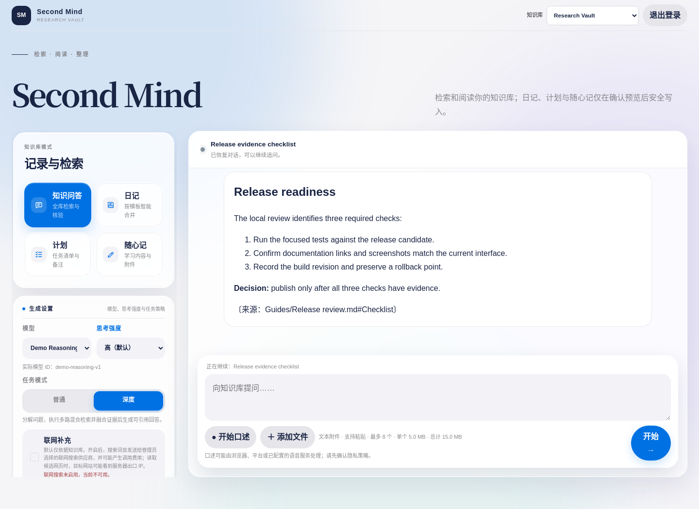
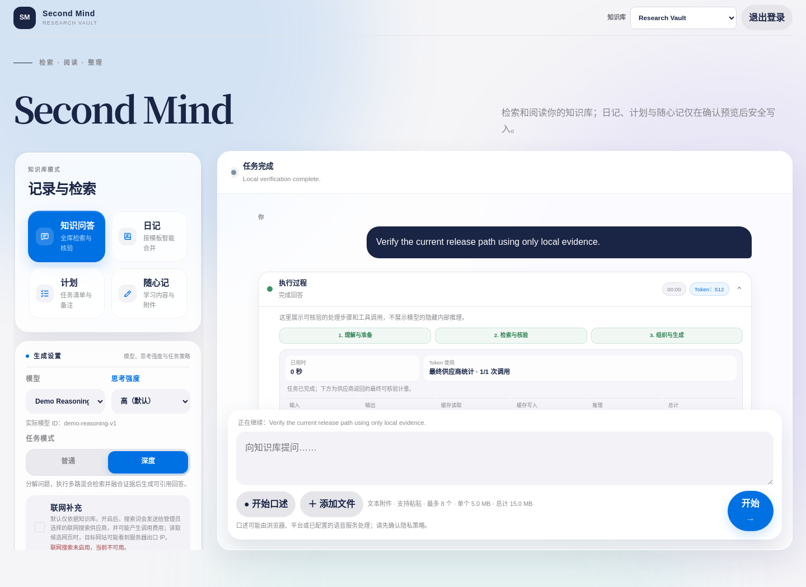
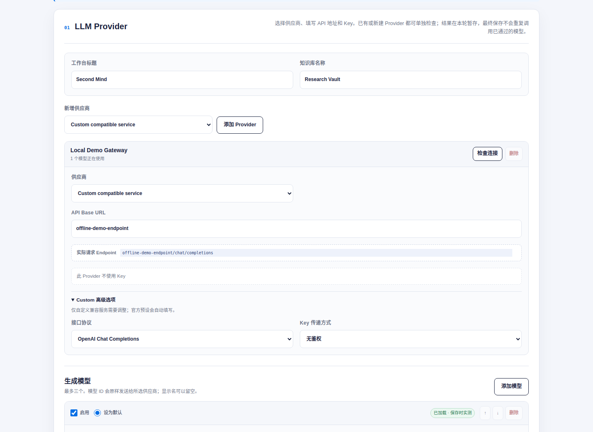
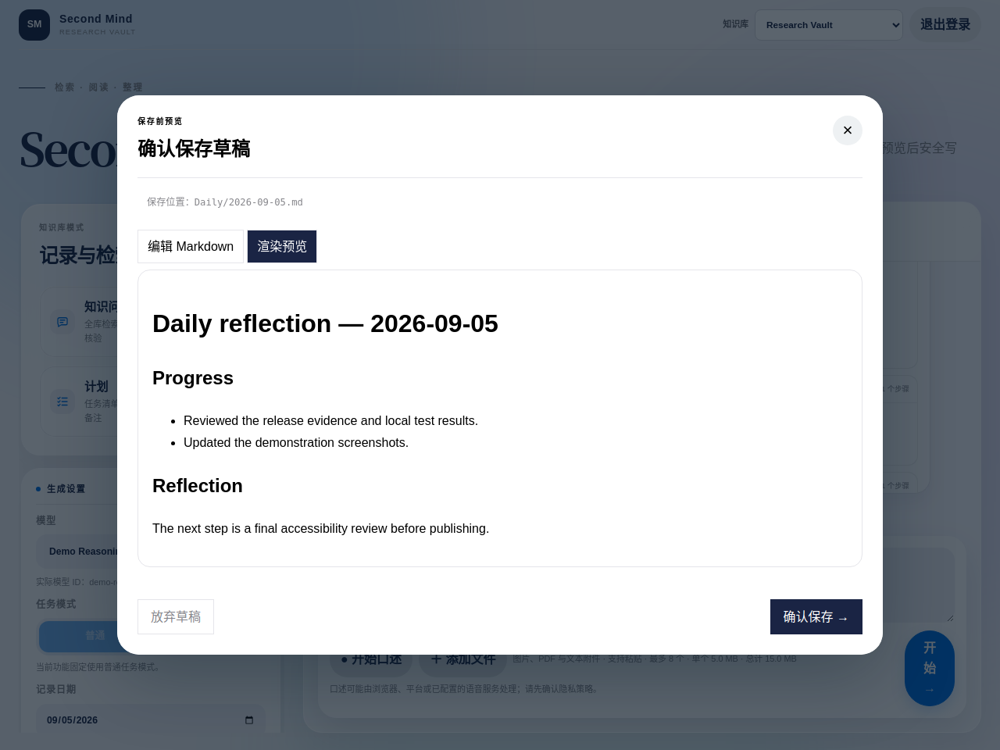
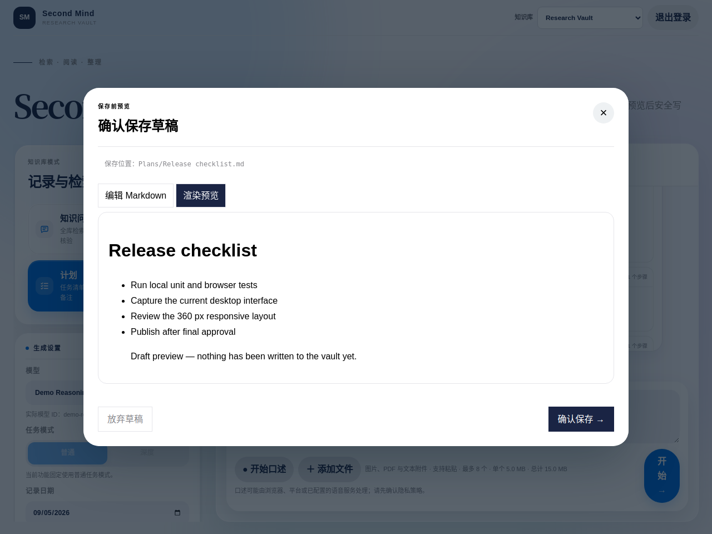
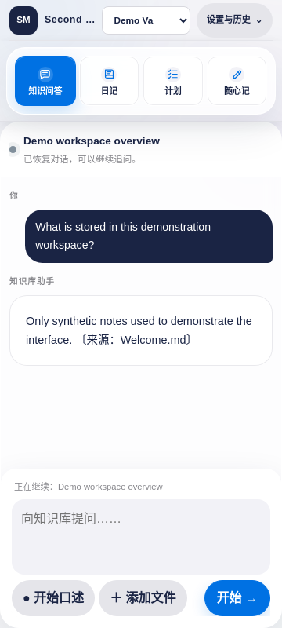
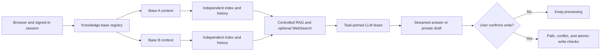

# Second Mind

[简体中文](README.md) · [Website](https://kygoyuan2004.github.io/Second-Mind/) · [Windows](docs/quickstart-windows.md) · [macOS](docs/quickstart-macos.md) · [Linux](docs/quickstart-linux.md) · [Security](docs/security.md)

[](https://github.com/kygoyuan2004/Second-Mind/actions/workflows/ci.yml)
[](https://github.com/kygoyuan2004/Second-Mind/actions/workflows/pages.yml)

Second Mind is a single-administrator, self-hosted knowledge workbench for local Obsidian Vaults. It combines keyword and optional vector retrieval, cited answers, feedback-driven research, conversation continuity, and review-before-write diary, plan, and scratch-note workflows. The administrator brings the model, search, and embedding services. With no LLM configured, the app can still start, authenticate, manage knowledge bases, and perform BM25 keyword search.



> Every product image in this README is generated from the current application by the repository screenshot script. It uses an isolated port, a public synthetic Vault, and a mock LLM. It does not connect to a private deployment or a paid service.

## Open the sign-in page in three steps

Install Git, then install and start Docker. The installer asks only for a knowledge-base directory, an administrator password, and a port. It does not require Node.js or OpenSSL on the host, and it does not require hand-editing JSON.

Linux or macOS:

```bash
git clone https://github.com/kygoyuan2004/Second-Mind.git
cd Second-Mind
./install.sh
```

Windows PowerShell with Docker Desktop using the WSL2 backend and Linux containers:

```powershell
git clone https://github.com/kygoyuan2004/Second-Mind.git
cd Second-Mind
powershell -ExecutionPolicy Bypass -File .\install.ps1
```

The installer first tries `ghcr.io/kygoyuan2004/second-mind:latest` for `linux/amd64` or `linux/arm64`, then builds from the checked-out source if the pull fails. It never stops a process that owns the requested port. Choose another port instead. When setup completes, open the loopback URL printed in the terminal and sign in as `admin`.

Platform details and troubleshooting:

- [Windows 10/11](docs/quickstart-windows.md)
- [macOS on Intel or Apple Silicon](docs/quickstart-macos.md)
- [Linux on amd64 or arm64](docs/quickstart-linux.md)

## What is implemented

| Area | Current behavior |
|---|---|
| Multiple knowledge bases | Stable IDs, names, enabled/default state, bounded mounts, a workbench selector, and an administrator registry |
| Isolation | Separate indexes, conversations, drafts, recovery copies, and audit records for each base; cross-base task, conversation, and draft IDs fail |
| Retrieval | Chinese-aware BM25; optional OpenAI-compatible or DashScope embeddings; hybrid RRF; explicit fallback when semantic retrieval is unavailable |
| Answers | A Normal retrieval path and bounded Deep multi-path retrieval; server-controlled tools; citations to concrete Vault-relative paths |
| Web supplement | Explicitly enabled per conversation; Alibaba Model Studio WebSearch MCP or Tavily REST; safe page reading with Vault-only fallback |
| Conversations | Refresh recovery; child conversations when model, effort, or web settings change; Normal and Deep may switch inside one conversation |
| Writes | Diary, plan, and scratch-note generation; editable Markdown preview; explicit confirmation; path and conflict checks; recovery copies |
| Rendering | Sanitized Markdown, code blocks, tables, and inline or block KaTeX |
| Providers | Alibaba Model Studio, DeepSeek, GLM, Kimi, and Custom; at most three enabled models; keys are never returned |
| Operations | Docker Compose, health checks, `doctor`, `status`, `logs`, `update`, `backup`, and a multi-architecture GHCR workflow |

This is not a multi-tenant SaaS product, and it does not give a model shell or arbitrary filesystem access. Application code selects and delimits all model context and controls web search, page reading, indexing, and writes.

## Current interface

| Execution trace | Provider configuration |
|---|---|
|  |  |
| **Retrieval and generation over a public synthetic Vault** | **Fictional providers; no screenshot key is displayed or stored** |

| Diary preview | Plan preview |
|---|---|
|  |  |
| **Still outside the Vault and not yet confirmed** | **Still outside the Vault and not yet confirmed** |



## How multiple knowledge bases work

The first installation may point to one Vault or to a parent containing several Vaults. Parent mode discovers only immediate child directories that contain `.obsidian`. Whether discovered or registered later, every knowledge-base root must contain an actual, non-symlink `.obsidian` directory. The administrator can then add, rename, disable, or choose a default knowledge base using paths relative to mounts authorized at startup.

Every knowledge API request is bound to a `knowledgeBaseId` and the current revision:

- Search, preview, citations, conversations, tasks, SSE, drafts, and confirmed writes use one knowledge-base context.
- A task created in base A remains in A while the browser switches to base B.
- Old responses or SSE events from A cannot update the interface after a switch to B.
- A broken or failed index does not prevent another healthy base from starting.
- Absolute paths, symbolic links, traversal, duplicate or nested Vaults, and overlap with private application state are rejected.
- Removing a registry entry does not delete notes, indexes, conversations, or drafts.

Saving the registry requires the administrator password again and the revision returned by the last read. A concurrent save, or an affected base with an active task, causes a conflict instead of an overwrite. A private binding ledger permanently binds each stable ID to its first canonical Vault path; deletion and restart do not release the ID, and redirecting it to another path is rejected.

## Browser configuration and BYOK

After signing in, the administrator page configures these independently:

1. LLM provider, API Base, models, and five application-level reasoning tiers.
2. Optional WebSearch provider and its own key.
3. Optional embedding provider, model, and its own key.

LLM, WebSearch, and embedding credentials never fall back to one another. APIs return a `configured` boolean, not the key. The browser does not put keys in localStorage, sessionStorage, URLs, or cookies. Changing a provider destination requires supplying the credential for that destination again.

Connection checks and embedding builds may cost money, so they run only after explicit administrator confirmation. Startup, sign-in, configuration refresh, and BM25 retrieval do not call a paid provider. A running task keeps the model, search, and index snapshot it acquired at creation; later saves affect new tasks.

## RAG, research, and conversations

Normal mode follows one controlled retrieval path. Deep mode creates a bounded set of complementary queries, combines evidence, checks conflicts and gaps, and can run bounded feedback rounds when the research loop is enabled. Both modes allow only the Vault-relative paths actually supplied to the model to become Vault citations. Unsupported conclusions should say that evidence is insufficient.

Web search is off by default and is available only to Q&A. When enabled, results pass URL and domain checks. Optional page reading also enforces DNS/IP, redirect, media type, size, timeout, and concurrency limits. The model itself does not receive an MCP client, browser, or fetch tool.

The browser persists only an opaque conversation ID for the current user and knowledge base. Changing the fixed model, reasoning effort, or web option makes the next message a child conversation and copies at most five complete question-and-answer turns. Raw pages, search snippets, and hidden reasoning are not stored as conversation messages.

## Review before write

Diary, plan, and scratch-note content is first generated into a private draft directory outside the Vault. The user reviews the Markdown, destination path, and attachments, then explicitly confirms. The server rechecks directories, symbolic links, destination hashes, and concurrent changes before atomically replacing a file. A verified recovery copy is retained before an existing diary or plan is replaced.

Output checks, filename checks, and extension checks do not prove an attachment is safe. Do not open untrusted attachments in desktop software, and do not treat sync as backup.

## Architecture



**This is an architecture diagram, not a product screenshot.** See [the architecture guide](docs/architecture.md) and [data-flow guide](docs/data-flow.md) for components and trust boundaries.

## Privacy and remote data boundaries

| Destination | Contacted only when | Data that can be sent |
|---|---|---|
| LLM | A user starts generation and a model is configured | Question, recent complete turns, selected note excerpts, and text attachment excerpts |
| Embedding | An administrator confirms a build, or semantic retrieval uses an active vector index | Indexable text chunks or a search query |
| WebSearch | The current Q&A conversation explicitly enables it | A bounded set of server-generated search terms |
| Safe page reader | WebSearch is enabled and research selects a source | A validated public HTTPS URL; extracted text may then enter delimited model context |

Vaults, conversations, indexes, drafts, recovery copies, audits, and credentials stay in local storage by default. If you choose a remote provider, shared data is governed by that provider's retention, region, account, and contractual terms. Use separate, least-privilege, replaceable keys and bounded spending limits.

Self-hosted does not mean every operation is local-only. Enabling a remote LLM, embedding service, WebSearch, or page reader sends the corresponding selected content off-host. If content must never leave the host, use a browser on that host, use only compatible providers running there, disable web and remote sync, and keep backups in controlled local storage.

Compose publishes only to `127.0.0.1` by default. For remote access, use a reviewed private network or an HTTPS reverse proxy. Do not expose the application port directly to the public internet. See [security](docs/security.md) and [networking](docs/networking.md).

## Backup, update, and removal

```bash
./install.sh doctor
./install.sh status
./install.sh logs --no-follow --tail 200
./install.sh backup
./install.sh update
```

PowerShell uses the same subcommands. On a host that restricts script execution, keep the process-scoped override, for example `powershell -ExecutionPolicy Bypass -File .\install.ps1 doctor`.

Each installation has its own Compose project, private configuration directory, and data volume. `backup` copies the Vault, runtime data, and configuration and writes SHA-256 inventories. It is a live copy, not an atomic point-in-time snapshot across application and sync writes, and it does not automatically collect an independent sync engine's private volumes, account state, or remote state. Stop the instance and external sync before a strict snapshot, then test restoration in an isolated directory.

There is no automatic restore or permanent uninstall command. For ordinary removal, run `docker compose down` for the exact instance without `--volumes`, preserving the Vault, credentials, conversations, indexes, and backups. Before permanent deletion, make and verify a backup, then inspect each exact named volume and configuration directory. Never use a broad recursive deletion against a user directory or Vault.

## Known limitations

- One administrator account only. There is no multi-user authorization, tenant isolation, or external identity login.
- The application reads filesystem Vaults. Self-hosted LiveSync is not implemented. Obsidian Headless is an optional sync boundary that needs separate review.
- The standard image omits `bwrap` and `pdftotext`, so web-page PDF reading is unavailable by default and never silently falls back to unsandboxed parsing. Persisting a confirmed PDF attachment is not PDF-content understanding.
- Windows Service, macOS LaunchDaemon, Credential Manager, and Keychain integration are not implemented.
- Installer backups do not preserve every platform ACL or extended attribute and are not atomic across the app and a sync engine.
- Docker `--mount` cannot reliably represent a host path containing a comma. Spaces, non-ASCII text, and Windows drive-letter paths are covered by installer tests.
- The Linux quick installer targets a conventional rootful Docker Engine. Rootless Docker and SELinux-enforcing hosts need an administrator-designed UID mapping, volume ownership, and bind-mount relabeling; the installer does not silently alter those boundaries.
- `update` preserves data and configuration but has no automatic image rollback. Critical deployments should pin an immutable tag/digest, retain the previous image, and validate upgrades against a backup copy.
- A `knowledgeBaseId` is bound to its canonical path. If a host operator replaces that exact path with different Vault contents, use a new ID so retained private state from the former Vault cannot reopen.
- Model compatibility depends on the target API actually implementing the selected protocol. A compatible label does not mean all model features are identical.

## Development and tests

Automated tests use temporary directories, synthetic data, and mock providers. They do not call real paid APIs.

```bash
npm ci
npm run check
npm test
npm run security:scan
npm run security:history
npm run site:check
npm run verify
```

Linux release gates also cover Compose configuration, image build, isolated container liveness and readiness, browser E2E, KaTeX regressions, image history and environment inspection, and screenshot OCR and metadata checks.

## Documentation

- [Configuration and providers](docs/configuration.md)
- [HTTP API](docs/api.md)
- [Architecture](docs/architecture.md)
- [Data flow](docs/data-flow.md)
- [Deployment](docs/deployment.md)
- [Security](docs/security.md)
- [Remote access](docs/networking.md)
- [Vault sync boundary](docs/sync.md)

## License

[MIT](LICENSE)
