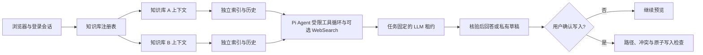

<p align="center">
  <a href="docs/assets/second-mind-hero.png">
    
  </a>
</p>

<p align="center"><em>项目插画，不是产品界面截图。</em></p>

<h1 align="center">Second-Mind</h1>

[English](README.en.md) · [在线网站](https://kygoyuan2004.github.io/Second-Mind/) · [Windows](docs/quickstart-windows.md) · [macOS](docs/quickstart-macos.md) · [Linux](docs/quickstart-linux.md) · [Pi Agent 迁移与运维](docs/pi-agent-migration.md) · [Claude Code 辅助安装](docs/claude-code-install.md) · [安全边界](docs/security.md)

[](https://github.com/kygoyuan2004/Second-Mind/actions/workflows/ci.yml)
[](https://github.com/kygoyuan2004/Second-Mind/actions/workflows/pages.yml)

Second Mind 是一个面向本地 Obsidian Vault 的单管理员、自托管知识工作台。它把关键词与可选向量检索、带引用的问答、反馈式研究、限定日期范围的学习回顾、会话连续性，以及日记、计划、随心记的确认后写入放在同一个网页中。模型、搜索和 Embedding 由管理员自带；未配置 LLM 时仍可登录、管理知识库并使用 BM25 关键词检索。


> 顶部 hero 是项目插画，不是产品界面。其余六张 UI 图由仓库截图脚本在隔离回环服务中加载当前生产前端，并连接脚本提供的确定性合成 fixture API；它们不来自完整生产服务实例，不读取真实 Vault，也不调用真实或付费 Provider。

## 三步打开登录页

先安装 Git，并安装和启动 Docker。安装器只询问知识库目录、管理员密码和端口，不要求宿主机安装 Node.js、OpenSSL，也不要求手工编辑 JSON。

Linux / macOS：

```bash
git clone https://github.com/kygoyuan2004/Second-Mind.git
cd Second-Mind
./install.sh
```

Windows PowerShell，使用 Docker Desktop 的 WSL2 backend 与 Linux containers：

```powershell
git clone https://github.com/kygoyuan2004/Second-Mind.git
cd Second-Mind
powershell -ExecutionPolicy Bypass -File .\install.ps1
```

安装器优先拉取 `ghcr.io/kygoyuan2004/second-mind:latest` 的 `linux/amd64` 或 `linux/arm64` 镜像，拉取失败时从当前源码构建。它不会停止占用端口的进程，而是要求选择新端口。完成后访问终端显示的回环地址，并以 `admin` 登录。

平台细节与故障排查：

- [Windows 10/11](docs/quickstart-windows.md)
- [macOS Intel / Apple Silicon](docs/quickstart-macos.md)
- [Linux amd64 / arm64](docs/quickstart-linux.md)

## 当前功能

| 能力 | 当前实现 |
|---|---|
| 多知识库 | 稳定 ID、显示名、启用/默认状态、受限挂载点；工作台选择器与管理员注册表 |
| 隔离 | 每库独立索引、会话、草稿、恢复副本和审计；跨库任务、会话、草稿 ID 会失败 |
| 检索 | 中文感知 BM25；可选 OpenAI-compatible 或 DashScope Embedding；混合 RRF；语义失效时明确降级 |
| 问答 | 嵌入式 Pi Agent `0.85.1` 根据受限工具结果继续检索和读取；答案引用具体 Vault 相对路径 |
| 学习回顾 | [固定日期范围、日期记录清单与分批核验](docs/learning-review.md)；区分计划与完成，显示实际覆盖缺口 |
| 联网补充 | 每个会话显式选择；Alibaba Model Studio WebSearch MCP 或 Tavily REST；安全网页读取与 Vault-only 降级 |
| 会话 | 刷新恢复；模型、思考强度或联网设置变化时派生子会话；Normal 与 Deep 可在原会话切换 |
| 写入 | 日记、计划、随心记生成；可编辑 Markdown 预览；明确确认后只写入允许目录；冲突检查和恢复副本 |
| 渲染 | 安全 Markdown、代码块、表格与 KaTeX 行内/块级公式 |
| Provider | Alibaba Model Studio、DeepSeek、GLM、Kimi 与 Custom；最多启用三个模型；Key 永不回显 |
| 运维 | Docker Compose、健康检查、`doctor`、`status`、`logs`、`update`、`backup`、GHCR 多架构工作流 |

这不是多租户 SaaS，也不是拥有 shell 或任意文件系统权限的通用 Agent。Pi Agent 只获得当前用户、知识库和快照范围内的只读知识工具；联网仍需用户明确选择，知识库写入仍须草稿预览和用户确认。SDK 随 npm 依赖和 Docker 镜像交付，不读取宿主机的 `~/.pi` 或 `~/.claude`。

## 界面截图

| 执行过程 | Provider 配置 |
|---|---|
|  |  |
| **确定性 fixture 问答的检索与生成阶段** | **虚构 Provider；没有显示或保存截图用 Key** |

| 日记预览 | 计划预览 |
|---|---|
|  |  |
| **仍在 Vault 外，尚未确认写入** | **仍在 Vault 外，尚未确认写入** |


## 多知识库如何工作

首次安装可以选择一个 Vault，也可以选择包含多个 Vault 的父目录。父目录模式只发现下一层中带 `.obsidian` 的目录。无论自动发现还是后来注册，每个知识库根都必须包含实际目录（不是符号链接）的 `.obsidian`。管理员随后可在启动时授权的挂载点内，用相对路径添加、重命名、禁用或切换默认知识库。

每次知识 API 请求都绑定 `knowledgeBaseId` 与当前 revision：

- 搜索、预览、引用、会话、任务、SSE、草稿和确认写入使用同一知识库上下文；
- 在 A 中创建的运行任务始终留在 A，浏览器可以同时切到 B；
- A 的旧响应或 SSE 事件不能更新已经切到 B 的界面；
- 一个库损坏或索引失败不会阻止其他健康库启动；
- 绝对路径、符号链接、目录逃逸、重复或嵌套 Vault，以及与私人状态重叠的路径都会被拒绝；
- 删除注册项不会删除笔记、索引、会话或草稿。

管理员保存注册表时必须再次输入密码，并携带读取到的 revision。若有别的页面先保存，或相关库仍有活动任务，更新会失败而不是覆盖。私有绑定清单会把稳定 ID 永久绑定到首次规范化的 Vault 路径；即使删除注册项或重启也不会释放该 ID，把它改指向另一条路径会被拒绝。

## 网页配置与 BYOK

登录管理员页后，可分别配置：

1. LLM Provider、API Base、模型与五档应用级思考强度；
2. 可选的 WebSearch Provider 和独立 Key；
3. 可选的 Embedding Provider、模型和独立 Key。

LLM、WebSearch 与 Embedding 凭据不互相回退。API 只返回 `configured` 布尔状态，不返回 Key。浏览器不把 Key 写入 localStorage、sessionStorage、URL 或 Cookie。变更 Provider 地址时必须重新提供该目标的凭据。

模型连接检查与 Embedding 构建可能产生费用，因此只在管理员明确确认后执行。模型检查会实测一次“模型 → 工具 → 结果 → 模型”往返；只会文本生成、不能读取工具结果的兼容端点不会保存为 Pi-ready。启动、登录、刷新配置和 BM25 检索不会主动调用付费 Provider。运行中的任务固定使用创建时的模型、搜索和索引快照，新任务才使用保存后的版本。

## Pi Agent、研究与会话

Normal 与 Deep 均由嵌入式 Pi Agent 运行受限工具循环：模型可根据结果继续列目录、搜索、调用混合检索、按行读取原文、解析引用并核对实际覆盖；Deep 给予更高的有界研究预算。搜索只用于发现，重要结论须读取原文核验。两种模式都只把实际读取且进入模型上下文的 Vault 相对路径作为可引用来源；无法支持的结论应明确说明证据不足。

联网搜索默认关闭，且只能用于问答。启用后，Agent 必须先完成必要的联网搜索和页面读取，再读取私库；任何 Vault 工具结果返回后，本任务的所有 Web 搜索与读取出口永久关闭。为防止上一轮私库文本成为新的搜索词，每个启用联网的 Pi 回合都只向 Agent 加载当前请求，不恢复或注入之前的对话正文；上下文依赖的联网问题应在当前请求中重述必要的公开上下文。搜索结果先经过 URL 与域名检查；可选页面读取还会执行 DNS/IP、重定向、类型、大小、超时和并发限制。Agent 不拥有任意浏览器、抓取器或未注册的 MCP 工具。

Pi 回答在服务端完成原文引用与外链核验前保持缓冲；SSE 依然持续发送会话、工具、用量和心跳进度，但浏览器只渲染终态核验后的 Markdown。外部来源以不透明 ID 引用，只有服务端能生成可点击的 HTTPS 链接；模型生成的其他 Markdown、HTML、自动链接和邮箱链接会被拆除。

浏览器只持久化当前用户和知识库对应的不透明会话 ID。更换固定模型、思考强度或联网选项时，下一条消息会派生子会话，并最多复制五轮完整问答；不会把原始网页、搜索片段或隐藏推理保存为会话内容。

## 确认后写入

日记、计划和随心记先生成到 Vault 外的私有草稿目录。用户可以检查 Markdown、目标相对路径和附件，再明确确认。服务器随后重新校验目录、符号链接、目标哈希和并发变化，通过后才原子替换文件。覆盖既有日记或计划前会保留校验过的恢复副本。

模型输出、文件名检查和扩展名检查不能证明附件安全。不要在桌面软件中打开不可信附件，外部同步也不能替代备份。

## 架构



**这是架构图，不是产品截图。** 更完整的组件、数据流和信任边界见 [docs/architecture.md](docs/architecture.md) 与 [docs/data-flow.md](docs/data-flow.md)。

## 隐私与远程数据边界

| 目的地 | 只有在何时访问 | 可能发送的数据 |
|---|---|---|
| LLM | 用户发起生成，且已配置模型 | 问题、近期完整会话，以及受限工具定义与结果；工具结果可包含所选原文片段和文本附件片段 |
| Embedding | 管理员确认构建或用户进行语义查询 | 可索引文本块或搜索查询 |
| WebSearch | 当前问答会话显式启用，且尚未返回任何 Vault 工具结果 | Agent 在该任务内生成的有限查询 |
| 安全网页读取 | 同一任务的 WebSearch 已返回精确 HTTPS URL | 经过验证的该 URL；读取结果随后作为定界文本交给模型 |

Vault、会话、索引、草稿、恢复副本、审计和凭据默认留在本机卷。若选择远程 Provider，与其共享的数据受该 Provider 的条款、保留策略、区域和账号权限约束。请使用最小权限、独立额度与可轮换的 Key。

“自托管”不等于“所有操作始终仅在本地”：启用远程 LLM、Embedding、WebSearch 或网页读取后，表中对应的选定内容会离开主机。若要求内容绝不出站，请只从本机浏览器访问，只使用在同一主机运行的兼容 Provider，禁用联网与远端同步，并把备份留在受控本地存储。

Compose 默认只发布 `127.0.0.1`。需要远程访问时，应使用经过审查的私有网络或 HTTPS 反向代理，不要直接把应用端口暴露到公网。详见 [docs/security.md](docs/security.md) 和 [docs/networking.md](docs/networking.md)。

## 备份、更新与卸载

```bash
./install.sh doctor
./install.sh status
./install.sh logs --no-follow --tail 200
./install.sh backup
./install.sh update
```

PowerShell 使用相同子命令；在限制脚本执行的系统上继续使用进程级绕过，例如 `powershell -ExecutionPolicy Bypass -File .\install.ps1 doctor`。

每个安装实例有独立 Compose project、私有配置目录和数据卷。`backup` 保存 Vault、运行数据和配置，并为内容生成 SHA-256 清单；它是实时复制，不保证外部同步与运行写入之间的原子时间点一致性，也不会自动收集独立同步器的私有卷、账号状态或远端状态。严格恢复前应停止本实例和同步程序，在隔离目录验证备份。

当前没有自动恢复或永久卸载命令。普通卸载应对精确实例执行 `docker compose down` 且不带 `--volumes`，从而保留 Vault、凭据、会话、索引和备份。永久删除前必须先备份并分别核对具体命名卷和配置目录；不要对用户目录或 Vault 做宽范围递归删除。

## 已知限制

- 只有一个管理员账号，没有多用户授权、租户隔离或外部身份登录。
- 应用读取本地文件系统 Vault；Self-hosted LiveSync 没有实现，Obsidian Headless 只是需单独审查的可选同步边界。
- 标准镜像没有安装 `bwrap` 与 `pdftotext`，所以网页 PDF 读取默认不可用；不会静默回退到无 sandbox 解析。确认后的 PDF 附件持久化不等于 PDF 内容理解。
- Windows Service、macOS LaunchDaemon、Credential Manager 与 Keychain 集成都没有实现。
- 安装器的备份不保留所有平台 ACL/xattr，也不是应用与同步器的原子快照。
- Docker `--mount` 不能可靠处理名称含逗号的宿主机路径；空格、中文和 Windows 盘符有测试覆盖。
- Linux 快速安装针对常规 rootful Docker Engine；rootless Docker 与启用 SELinux 的宿主机需要管理员另行设计 UID 映射、卷权限和 bind-mount relabel，本安装器不会静默修改这些边界。
- `update` 会保留数据和配置，但没有自动镜像回滚；关键部署应固定不可变 tag/digest、保留上一镜像，并先在备份副本上验证升级。
- `knowledgeBaseId` 绑定规范化路径。若宿主机在完全相同的路径替换成另一套 Vault 内容，必须使用新 ID，避免重新打开旧库保留的私有状态。
- 模型兼容取决于目标 API 是否真正实现所选协议；显示为 compatible 不代表所有模型能力相同。

## 开发与测试

所有自动测试使用临时目录、合成数据和 mock Provider，不访问真实付费 API。

```bash
npm ci
npm run check
npm test
npm run security:scan
npm run security:history
npm run site:check
npm run verify
```

发布截图使用 Chrome for Testing `134.0.6998.88` 作为可复现的采集基线（不是一般浏览器兼容性限制）；CI 使用的官方 Linux archive SHA-256 是 `99f05b875209cdbf7490dc431a525fd373788521fb9e8aca68c761fc5fc400e5`：

```bash
npm run docs:screenshots -- --chrome /path/to/chrome
npm run security:ocr
```

截图器只连接它启动的隔离回环服务，在浏览器中加载生产前端，并由脚本内的确定性合成 fixture API 提供会话、知识库、任务、草稿和 Provider 状态。它不会启动完整 Second Mind 服务、读取真实 Vault 或调用真实 Provider。截图器拒绝远程请求，固定生成三张 `1440x1050`、两张 `1280x960` 和一张 `360x800` PNG，移除 `tEXt`、`zTXt`、`iTXt`、`tIME`、`eXIf`、`pHYs` metadata；提交前须再运行 OCR 检查。

Linux 发布门禁还执行 Compose config、镜像 build、隔离容器的 `health/live` 与 `health/ready`、浏览器 E2E、KaTeX 回归、镜像 history/inspect，以及截图 OCR/metadata 检查。

## 文档

- [Pi Agent 迁移、部署与回滚](docs/pi-agent-migration.md)
- [Claude Code 辅助安装](docs/claude-code-install.md)
- [配置与 Provider](docs/configuration.md)
- [HTTP API](docs/api.md)
- [架构](docs/architecture.md)
- [数据流](docs/data-flow.md)
- [部署](docs/deployment.md)
- [安全](docs/security.md)
- [网络访问](docs/networking.md)
- [Vault 同步边界](docs/sync.md)

## License

[MIT](LICENSE)
