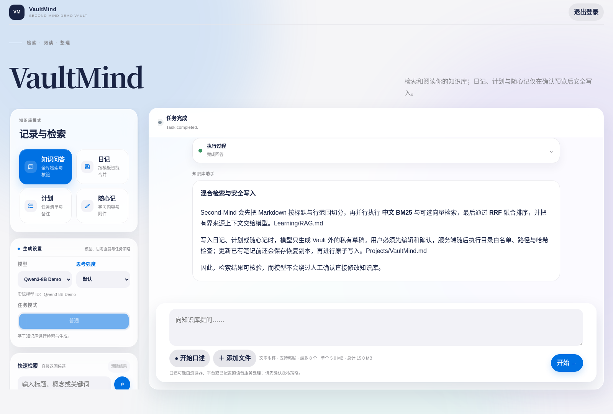
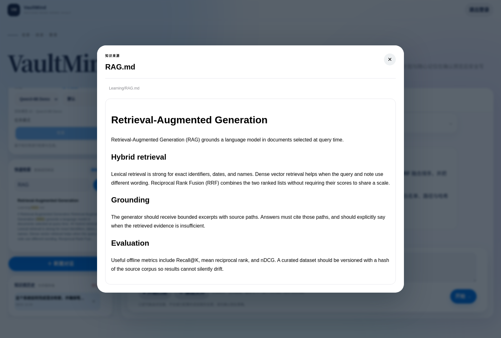
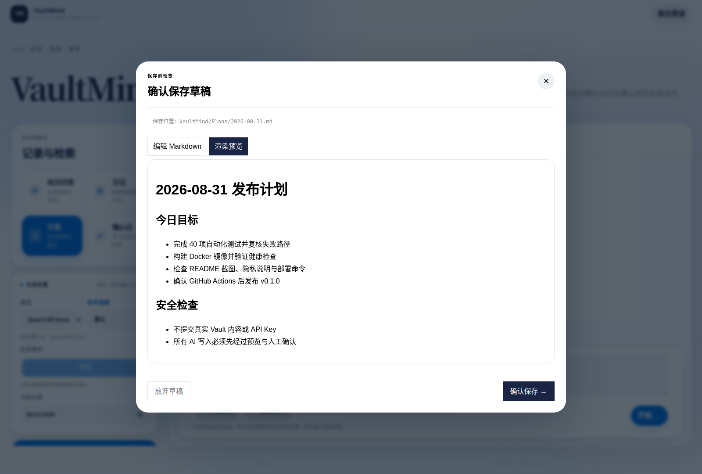
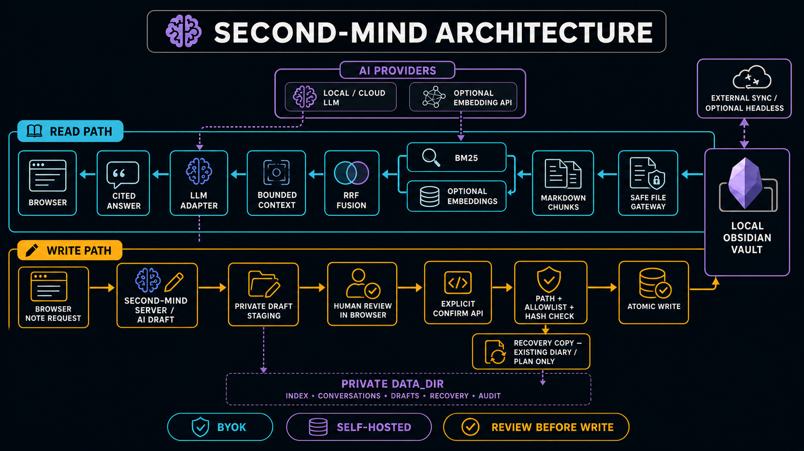

# Second-Mind

Self-hosted, provider-neutral retrieval-augmented generation (RAG) for an
Obsidian Vault that exists on the server as ordinary files.

[简体中文](docs/README.zh-CN.md) · [Architecture](docs/architecture.md) ·
[Configuration](docs/configuration.md) · [API](docs/api.md) ·
[Deployment](docs/deployment.md) · [Security](docs/security.md) ·
[Sync](docs/sync.md) · [Resume and interview notes](docs/resume.md)

Second-Mind combines a responsive Chinese web workspace, a single-node Node.js
service, lexical and optional vector retrieval, streaming model output, and a
review-before-write workflow for diaries, plans, and inbox notes. Bring your
own model endpoint and, optionally, a separate embedding endpoint. API keys
stay on the server.

Second-Mind currently ships its web workspace under the internal **VaultMind**
UI brand. The screenshots below show that unchanged runtime interface.

<p align="center">
  <a href="docs/assets/second-mind-grounded-qa.png">
    
  </a>
</p>
<p align="center"><sub>All UI screenshots were captured from a real, isolated Second-Mind demo using synthetic notes and a deterministic OpenAI-compatible demo endpoint. No personal notes or production credentials are shown.</sub></p>

> [!IMPORTANT]
> Second-Mind is a single-administrator private knowledge service, not a
> multi-tenant SaaS platform. It always reads a **local filesystem Vault**.
> Synchronization is a separate operator-managed process.

## What works today

| Area | Current implementation |
|---|---|
| Knowledge Q&A | Source-grounded answers with Obsidian-style citations and server-sent event (SSE) streaming |
| Retrieval | Chinese-aware BM25; optional dense embeddings; cosine ranking plus Reciprocal Rank Fusion (RRF); lexical fallback when embeddings fail |
| Note workflows | Diary, plan, and scratch/inbox generation with editable Markdown preview and explicit confirmation before write |
| Files | Keyword and semantic search, safe source preview, text attachments for Q&A, and confirmed attachment persistence for note modes |
| Providers | OpenAI-compatible chat APIs, Anthropic Messages API, OpenAI-compatible embeddings, and native DashScope embeddings |
| Local models | Ollama, vLLM, LM Studio, or another compatible endpoint through the OpenAI-compatible adapter |
| Operations | Docker Compose, optional file-backed secrets, health checks, index reconciliation, audit events, Caddy/Nginx examples, and Tailscale guidance |
| Synchronization | Plain filesystem mode; optional locally built Obsidian Headless sidecar; other external filesystem materializers |

Self-hosted LiveSync is **not implemented**. It appears only in the
[roadmap](#roadmap), and must not be represented as a current feature.

## Product tour

<table>
  <tr>
    <td width="50%" valign="top">
      <a href="docs/assets/second-mind-source-preview.png"></a>
      <br><sub><strong>Traceable retrieval.</strong> Open the exact Markdown source behind a search result or grounded answer.</sub>
    </td>
    <td width="50%" valign="top">
      <a href="docs/assets/second-mind-review-before-write.png"></a>
      <br><sub><strong>Review before write.</strong> Inspect or edit generated Markdown before an explicit confirmation can change the Vault.</sub>
    </td>
  </tr>
</table>

<p align="center">
  <a href="docs/assets/second-mind-mobile.png">
    
  </a>
</p>
<p align="center"><sub><strong>Responsive workspace.</strong> Knowledge Q&amp;A and source citations remain usable on a phone-sized viewport.</sub></p>

## Five-minute Docker quick start

This path assumes Docker Compose and an OpenAI-compatible model endpoint are
already available. The default example targets Ollama on the Docker host. The
repository's `vault/` directory is suitable for a disposable demo; point
`VAULT_HOST_PATH` at a backed-up real Vault for actual use.

Requirements:

- Docker Engine with Docker Compose v2;
- an LLM endpoint, or local Ollama with a pulled model;
- a writable local Vault directory;
- `openssl` for generating a session secret.

```bash
git clone https://github.com/kygoyuan2004/Second-Mind.git
cd Second-Mind
cp .env.example .env
```

For local Ollama, pull the configured model and set these values in `.env`:

```bash
ollama pull qwen3:8b
```

```dotenv
VAULT_HOST_PATH=./vault

LLM_PROVIDER=openai-compatible
LLM_API_BASE=http://host.docker.internal:11434/v1
LLM_MODEL=qwen3:8b

EMBEDDING_PROVIDER=disabled
```

Keep the Compose UID/GID defaults for this quick start because the named data
volume is initialized for UID/GID `1000`. Advanced host identity mapping needs
the data volume and Vault permissions to be provisioned together; see the
[deployment guide](docs/deployment.md). Then create local secret files. The LLM
and embedding key files may be empty for an unauthenticated local endpoint.

```bash
mkdir -p secrets
chmod 700 secrets
umask 077
read -rsp "Choose a Second-Mind admin password (12+ characters): " VAULTMIND_ADMIN_PASSWORD
printf '\n'
printf '%s' "$VAULTMIND_ADMIN_PASSWORD" > secrets/admin_password
unset VAULTMIND_ADMIN_PASSWORD
openssl rand -hex 32 > secrets/session_secret
: > secrets/llm_api_key
: > secrets/embedding_api_key
chmod 600 secrets/*
```

Build and start:

```bash
docker compose \
  -f compose.yaml \
  -f compose.secrets.yaml \
  up -d --build

docker compose ps
curl --fail http://127.0.0.1:8787/health/live
curl --fail http://127.0.0.1:8787/health/ready
```

Open <http://127.0.0.1:8787> and sign in as `admin` with the password entered
above. The readiness check can remain in `starting` while a large Vault builds
its first index.

For a remote model, replace the provider values in `.env`, write its key to
`secrets/llm_api_key`, and keep provider transport on HTTPS. See
[Bring your own model and embeddings](#bring-your-own-model-and-embeddings).

## Architecture

<p align="center">
  <a href="docs/architecture.md">
    
  </a>
</p>
<p align="center"><sub>Click the diagram for component boundaries, request flows, and deployment details.</sub></p>

The read and write paths are deliberately different:

- **Read path:** safe Vault gateway → Markdown-aware chunks → BM25 and optional
  vectors → RRF → bounded context → model → cited answer.
- **Write path:** user input → model-generated Markdown → private draft outside
  the Vault → editable preview → explicit confirmation → conflict/path checks →
  verified preimage recovery copy for an existing diary/plan → second hash check
  → atomic file replacement in an allow-listed directory.

The model has no shell, arbitrary filesystem tool, or general web-search tool.
Vault content is treated as untrusted data in the grounding prompt.

## Retrieval design

Second-Mind indexes `.md`, `.txt`, `.json`, `.canvas`, `.base`, `.csv`, YAML, and
log files up to 2 MiB each. The indexer:

1. preserves headings, line ranges, lists, tables, and fenced code while
   creating overlapping chunks;
2. tokenizes Chinese text, dates, and programming identifiers for BM25;
3. optionally embeds only chunks whose content hash has changed;
4. ranks dense results by cosine similarity and fuses dense and lexical ranks
   with RRF;
5. deduplicates results by file and includes source paths and excerpts in the
   generation prompt;
6. falls back to keyword results with diagnostics when embeddings are disabled
   or unavailable.

Index generations are written atomically. The current and previous generation
are retained so startup can fall back after an incomplete or corrupt write.
Filesystem watchers trigger debounced updates, while periodic reconciliation
detects missed changes.

## Bring your own model and embeddings

Credentials are read by the server from environment variables or `*_FILE`
paths. They are never requested by, stored in, or returned to the browser.

### Chat models

| Endpoint | Configuration |
|---|---|
| OpenAI or another OpenAI-compatible service | `LLM_PROVIDER=openai-compatible`, HTTPS `LLM_API_BASE` ending at the provider's API root, provider model ID, server-side API key |
| Anthropic | `LLM_PROVIDER=anthropic`, `LLM_API_BASE=https://api.anthropic.com`, Anthropic model ID, server-side API key |
| Ollama on the Docker host | `LLM_PROVIDER=openai-compatible`, `LLM_API_BASE=http://host.docker.internal:11434/v1`, local model ID, empty key allowed |
| vLLM or LM Studio | OpenAI-compatible mode; use loopback, a private container network, or HTTPS |

OpenAI-compatible means the endpoint must implement the request and streaming
shapes used by `/chat/completions`; brand compatibility alone is not a test
guarantee. Validate the exact model and gateway before production use.

### Embeddings

`EMBEDDING_PROVIDER=disabled` gives BM25-only retrieval. To enable hybrid RAG:

```dotenv
EMBEDDING_PROVIDER=openai-compatible
EMBEDDING_API_BASE=https://your-provider.example/v1
EMBEDDING_MODEL=your-embedding-model
EMBEDDING_DIMENSIONS=768
```

The other implemented embedding adapter is `dashscope`, using its native
embedding payload. `EMBEDDING_DIMENSIONS` must exactly match the provider
output. Changing provider, model, or dimensions invalidates the previous
vectors and requires an index rebuild:

```bash
npm run index
```

Prefer a separate least-privilege embedding key. A remote embedding provider
receives document chunks during indexing and user queries at search time; a
remote LLM receives the prompt, recent conversation messages, selected note
excerpts, and text attachment excerpts.

Plain HTTP is accepted automatically only for loopback and
`host.docker.internal`. Non-local HTTP requires the explicit
`ALLOW_INSECURE_PROVIDER_HTTP=true` opt-in and should be limited to a trusted
private network.

## Review-before-write

Knowledge Q&A is read-only. Diary, plan, and scratch modes use a staged write
protocol:

- drafts and temporary attachments live under the private data directory, not
  inside the Vault;
- nothing is written to the Vault until the user reviews and confirms the
  Markdown preview;
- diary and plan saves compare the current note hash with the hash captured
  before generation and reject concurrent changes;
- before replacing an existing diary or plan, the server copies and verifies its
  preimage under `RECOVERY_DIR`, rechecks the live hash, and only then performs
  the atomic replacement; recovery copies default to 30-day retention through
  `RECOVERY_RETENTION_DAYS`;
- scratch notes receive a sanitized, collision-avoiding filename;
- writes are restricted to `DIARY_DIR`, `PLAN_DIR`, and `SCRATCH_DIR`;
- traversal, excluded paths, non-regular files, and symbolic links are denied;
- confirmed writes and draft deletion/creation attempt to append JSONL audit
  events; a post-commit audit failure is returned as an explicit warning rather
  than misreporting a successful Vault write as failed.

Recovery copies contain previous private note content, so protect and back up
the data directory according to its sensitivity. This protocol reduces
accidental overwrites and narrows the race window; it is not a distributed CAS
or transaction with a sync engine. Backups and conflict-preserving sync settings
remain necessary.

## Synchronization model

Second-Mind does not embed a sync client. `SYNC_PROVIDER` and
`SYNC_DISPLAY_NAME` describe which external process materializes the local
Vault.

- **Filesystem:** no managed synchronization; point Second-Mind at an existing
  local directory.
- **Official Obsidian Headless:** an optional Compose overlay builds the
  upstream `obsidian-headless` package locally and shares the Vault directory.
  It requires an Obsidian Sync subscription and separate interactive setup.
- **External:** another operator-managed process presents a normal local Vault.

The optional Headless component is an external upstream open-beta package that
requires Node.js 22. Its npm metadata is currently `UNLICENSED`. It is excluded
from the main image; the included Dockerfile is a **local installation recipe**.
Do not publish or redistribute the resulting sidecar image without upstream
permission. Review the current [official Headless documentation](https://obsidian.md/help/sync/headless),
[npm metadata](https://www.npmjs.com/package/obsidian-headless), and
[sync guide](docs/sync.md) before enabling it.

Self-hosted LiveSync/CouchDB support is not present: there is no CouchDB
service, credential loader, Setup URI handler, or tested materializer.

## Security boundaries

Implemented controls include:

- one configured administrator identity; signed `HttpOnly`, `SameSite=Strict`
  session cookies; in-memory login throttling;
- same-origin checks and `X-VaultMind-Request: 1` on mutating API calls;
- restrictive browser security headers and sanitized Markdown rendering;
- file-backed secrets with permission checks;
- excluded hidden/configuration paths, root containment, and symlink denial;
- remote-provider HTTPS enforcement unless explicitly overridden;
- non-root Docker execution, read-only root filesystem, dropped capabilities,
  `no-new-privileges`, PID limit, and loopback-only port publication.

Important boundaries:

- the current auth model is single-user and has no RBAC, SSO, or tenant
  isolation;
- the Docker Vault bind mount is read/write at the kernel level, so application
  path policy and host permissions are part of the write boundary;
- images and PDFs are persisted as confirmed attachments but are not scanned,
  OCRed, or interpreted by the model;
- browser dictation uses the browser's optional speech-recognition facility;
  some browser/platform implementations may send audio to their vendor, so
  verify that privacy behavior before dictating sensitive notes;
- remote providers receive private text; use local models when data must not
  leave the server;
- Docker daemon, host root, service account, backups, and sync credentials are
  privileged trust boundaries.

Read the full [security model](docs/security.md) and
[networking guide](docs/networking.md) before remote deployment. Keep the app
on loopback and use Tailscale Serve or an HTTPS reverse proxy; do not expose raw
port 8787 to the internet.

## Tests and retrieval evaluation

Install with Node.js 22 or newer, then run the complete local verification:

```bash
npm ci
npm run verify
```

`verify` performs syntax checks, the Node test suite, and a publication-blocker
scan for secrets/private paths. The suite covers authentication, request guards,
provider adapters, streaming, Chinese BM25 and hybrid retrieval, embedding
degradation, atomic index recovery, the authenticated API, draft conflicts,
preimage recovery copies, attachments, and filesystem policy.

Coverage is available separately:

```bash
npm run test:coverage
```

Run the included synthetic retrieval smoke evaluation:

```bash
VAULT_PATH=examples/demo-vault \
INDEX_DIR=/tmp/vaultmind-demo-index \
EMBEDDING_PROVIDER=disabled \
npm run eval -- --k 3 --min-recall 1
```

The three-query synthetic fixture currently reports Recall@3 `1.0000`, MRR
`0.8333`, and nDCG@3 `0.8770`. These numbers validate the evaluation pipeline;
they are **not** evidence of production retrieval quality. Replace the fixture
with a private, human-reviewed dataset before comparing models or retrieval
configurations. See [eval/README.md](eval/README.md).

Compose definitions can be rendered without starting containers:

```bash
docker compose -f compose.yaml config --quiet
docker compose -f compose.yaml -f compose.secrets.yaml config --quiet
docker compose -f compose.yaml -f compose.obsidian-sync.yaml config --quiet
```

## Project structure

```text
public/                         Chinese responsive web UI
src/
  server.mjs                   HTTP API, security headers, health checks
  task-manager.mjs             Q&A and note-generation task/SSE pipeline
  knowledge-index.mjs          chunking, BM25, vectors, RRF, persistence
  llm-client.mjs               OpenAI-compatible and Anthropic adapters
  embedding-client.mjs         OpenAI-compatible and DashScope adapters
  path-policy.mjs              Vault containment, exclusions, symlink policy
  vault-store.mjs              drafts, recovery copies, confirmed writes
  auth.mjs                     single-admin sessions and request guard
test/                          unit and end-to-end Node tests
eval/                          synthetic evaluation dataset and runner
examples/demo-vault/           publishable demo corpus
scripts/                       checks, reindexing, evaluation, secret scan
compose*.yaml                  base, secret, and optional sync deployments
docker/                        local-only Obsidian Headless build recipe
deploy/                        Caddy, Nginx, and systemd examples
docs/                          deployment, networking, security, and sync guides
```

## Deployment paths

- Docker Compose: [docs/deployment.md](docs/deployment.md)
- Private access with Tailscale Serve: [docs/networking.md](docs/networking.md)
- Public cloud HTTPS with Caddy or Nginx: [docs/networking.md](docs/networking.md)
- Dedicated systemd service: [docs/deployment.md](docs/deployment.md)
- Optional official Headless sidecar: [docs/sync.md](docs/sync.md)

Obsidian Sync is not a backup. Back up the Vault, private application state,
and deployment secrets independently, and test restoration.

## Current limitations

- Single administrator and single Node.js process; no RBAC, SSO, distributed
  task queue, or horizontal scaling.
- Filesystem-backed JSON index and conversation state are intended for a
  personal/small-team-sized single-node deployment, not an enterprise corpus.
- BM25 scoring is computed in process; very large Vaults need a different
  inverted-index/storage layer.
- Only supported text formats are indexed. Images and PDFs are previewed or
  attached, not OCRed or semantically parsed.
- Server-side speech transcription is unavailable; browser dictation depends
  on browser/platform support and may use a browser-vendor speech service.
- No general web search, shell access, arbitrary agent tools, or autonomous
  Vault mutation.
- Login throttling and active task state are in memory and reset on restart.
- Recovery copies and repeated draft hash checks do not provide a distributed
  lock or CAS with Sync.
- Obsidian Headless is an optional upstream dependency and is not distributed
  in the main image.
- Self-hosted LiveSync is not implemented.

## Roadmap

The following are design directions, not shipped features or delivery
commitments:

- [ ] A separate, tested Self-hosted LiveSync materializer with isolated
  CouchDB credentials, end-to-end encryption handling, and conflict/rename/
  attachment recovery tests.
- [ ] A pluggable sync/materializer interface beyond status labels.
- [ ] A scalable lexical/vector storage adapter and background job queue.
- [ ] Optional OCR/multimodal ingestion with explicit privacy controls.
- [ ] Multi-user identity/RBAC after a documented tenant-isolation design.
- [ ] Larger human-reviewed retrieval datasets, regression dashboards, and
  deployment observability.

## License

Second-Mind's repository code is available under the [MIT License](LICENSE).
Third-party components retain their own licenses. The optional locally built
`obsidian-headless` package is not covered by Second-Mind's MIT license.
