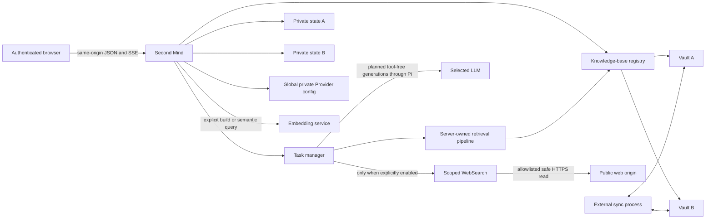

# Data flow and privacy boundaries

Second Mind keeps Vault files and application state local unless the administrator configures a remote Provider and a user or administrator starts an operation that needs it. No remote model, search, or embedding call is required for startup, sign-in, knowledge-base management, file preview, or BM25 keyword retrieval.

## Component flow



The browser never talks directly to a model, embedding endpoint, WebSearch service, or Vault filesystem. It sends an authenticated request to Second Mind. The server fixes one user, knowledge-base revision, index snapshot, model lease, and optional WebSearch lease for the task. The server chooses and executes every retrieval, filtering, date, batching, and Web stage; Pi performs only the planned tool-free generations.

## Browser to application

The browser sends:

- login credentials over the deployment's HTTP or HTTPS transport;
- an explicit `knowledgeBaseId` for knowledge operations;
- prompts, selected model/effort/task mode, and the Q&A WebSearch toggle;
- optional attachments within configured limits;
- edited draft Markdown and explicit save confirmation;
- Provider keys only during an administrator replace action.

The server returns an HttpOnly signed session cookie. The browser may retain opaque per-user/per-base selection and conversation IDs, but does not retain Provider keys in localStorage, sessionStorage, URLs, or cookies.

Use HTTPS or a reviewed private tunnel for remote access. The default Compose binding is loopback only.

## Local Vault and private state

Vaults remain ordinary host directories. The application indexes allowed files, reads source previews, and writes only configured diary, plan, and scratch-note destinations after confirmation. Excluded paths such as `.obsidian`, `.trash`, `.git`, `.sync`, `.livesync`, and `node_modules` do not enter search, direct file reads, or model context.

The knowledge-base registry maps stable public IDs to roots under startup-authorized mounts. Absolute host paths are not returned through public or administrator APIs. Each base has isolated indexes, conversations, drafts, recovery copies, audit logs, and embedding slots. Global Provider configuration and registry metadata live in separate private runtime state.

Private state includes derived copies of note content and must be protected like the Vault itself:

- BM25 and vector index files;
- conversation messages and source metadata;
- legacy Pi checkpoints, if retained for compatibility cleanup;
- drafts, temporary attachments, and recovery preimages;
- audit records;
- managed Provider destinations, model names, and credentials;
- registry mount mappings.

Deleting a registry entry does not delete that state or the Vault. Installer backups include Vault, runtime data, and configuration, including secrets.

## LLM egress

An LLM is contacted only when a user creates a generation task and an enabled model is configured. Q&A follows the bounded application pipeline and can contain several planned model generations. Depending on the stage, those requests can contain:

- the current prompt;
- up to the bounded recent complete conversation turns used for continuity;
- Vault search candidates, titles, relative paths, and bounded original excerpts selected by the application;
- text attachment excerpts;
- bounded WebSearch snippets or safely extracted public-page text when enabled;
- system instructions and output contracts;
- selected model and reasoning parameters.

Images and PDFs can be stored with confirmed note drafts but are not sent as multimodal Q&A input by the current task API. Q&A accepts text attachments only.

The model does not receive credentials, host absolute paths, index vectors, the registry document, arbitrary Vault access, a shell, an MCP client, or a general fetch tool. Search hits are discovery only. Source normalization permits a Vault citation only after non-empty, hash-verified original text from that path was returned through `read_note`; merely listing or searching for a path is insufficient.

A task leases its exact model connection and revision at creation. Later configuration edits do not redirect the in-flight task. Provider failures are redacted before they reach browser errors or logs.

The Pi SDK is invoked once per planned generation with `tools=[]`, no `AgentSession`, no automatic retry, and no built-in shell, read, edit, write, extension, skill, prompt, or `AGENTS.md` resources. It does not inherit host Pi/Claude configuration or credentials. Normal and Deep keep the application pipeline's 20-call/10-minute and 50-call/30-minute task ceilings respectively.

## Generation and conversation flow

The product conversation store is authoritative. For each request, Second Mind selects the bounded committed history and constructs the exact messages for each planned generation. Pi does not resume a private checkpoint or create a disposable JSONL branch.

After source and link normalization succeeds, the application atomically commits only product-visible user/assistant messages. A failed, cancelled, timed-out, or uncommitted task leaves the preceding conversation intact. Safe checkpoints left by earlier releases remain eligible for compatibility cleanup but never become new execution context.

## Embedding egress

Embedding is optional. BM25 remains local and requires no embedding call.

Remote text leaves the host in two cases:

1. An administrator confirms `validate-and-build` for the selected knowledge base. A probe may be sent to determine vector dimensions, followed by all eligible text chunks for that base.
2. A user requests semantic or hybrid retrieval against an active remote embedding profile. The search query is sent to create its query vector.

The desired embedding configuration is global, while active and previous vector slots are isolated per base. A candidate build does not become active until it completes. Failure or cancellation keeps the previous active index. Startup never triggers the first paid build.

Embedding responses and vectors are stored in local private index state. The configured Provider may retain request data according to its own terms.

## WebSearch egress

WebSearch is off by default and is only available for eligible Q&A. A deterministic personal learning/work review is local-only even when the conversation selected WebSearch; its evidence must come from the captured Vault snapshot. Enabling WebSearch in one conversation does not enable it for another. When enabled for other Q&A, the application calls the bounded `web_search` wrapper backed by the selected Alibaba Model Studio WebSearch MCP connection or Tavily REST connection.

Web-enabled work has no resumed Pi checkpoint and no model-controlled Web tool. The server-owned pipeline applies its existing context and outbound-request boundaries before sending any generation request.

The model cites a successfully read Web source with its opaque per-task ID, not a URL. Answer text remains server-buffered while Vault citations and external source IDs are checked. The server strips generated Markdown/HTML links and alone mints the final escaped HTTPS anchors; the assistant renderer unwraps any remaining unmarked anchor, including GFM `www` and email autolinks.

Search responses are treated as untrusted evidence. The application normalizes URLs, bounds results and context, records provider/source identity and failures, and can continue with Vault-only evidence when the remote path is unavailable. Pi cannot select a provider, inspect its credential, or issue a network request.

The selected WebSearch provider has its own credential. It does not receive an LLM or embedding key. An explicitly enabled extraction fallback may reuse only the selected WebSearch credential.

## Safe selected-page reading

Optional page reading begins only when the application passes `web_read` the exact HTTPS URL of a candidate returned earlier by the same task's `web_search`. It is not a general URL fetcher. For each request, the reader:

- allows public `https:` URLs only;
- rejects URL credentials, fragments as authority, and unsupported ports/schemes;
- resolves DNS and rejects loopback, private, link-local, multicast, reserved, and otherwise non-public IPs;
- connects to the validated address while preserving TLS hostname verification;
- revalidates each redirect;
- bounds redirects, response bytes, decoded characters, pages, concurrency, and time;
- accepts only configured HTML/text content, plus sandboxed PDF when explicitly available.

Fetched text is untrusted and enters the Pi model context as delimited evidence. Partial bodies and failures remain visible in the coverage ledger. Page text never becomes an instruction that can widen filesystem, network, or tool permissions.

The standard image does not contain the required sandboxed PDF toolchain, so PDF reading reports unavailable instead of using an unsandboxed fallback.

## Administrator validation egress

Saving a Provider change is separate from validating it. Explicit model validation performs one short, privacy-safe, tool-free Pi generation with a 64-token output ceiling and no automatic retry. WebSearch validation can make a small search request. Embedding validation can start the full-base operation described above. These actions may incur cost even if the candidate later fails.

Validation receipts are short-lived, one-use, bound to the administrator and source revision, and kept in process memory. They avoid persisting candidate keys in browser storage. Read APIs return configured booleans rather than secret values.

## Draft and write flow

```text
prompt -> optional remote generation -> private draft outside Vault
       -> browser review/edit
       -> explicit save
       -> owner, base, path, symlink, expiry, and hash checks
       -> optional verified recovery preimage
       -> temporary file and atomic rename inside the selected Vault
       -> per-base audit append
```

There is no distributed transaction with an external sync process. A content hash and final checks reduce races but cannot make two independent filesystem writers atomic. Preserve sync conflicts and maintain tested backups.

## External sync flow

Second Mind never uploads or reconciles a Vault on its own. If `SYNC_PROVIDER` labels a Headless or external sync process, that process has a separate network, account, encryption, and filesystem trust boundary. Its data flows and retention are governed by its operator and provider.

Do not run two sync engines against the same local Vault. Sync is not backup. See [sync.md](sync.md).

## Data-egress decision table

| Operation | Vault read | Vault write | Remote LLM | Remote embedding | Web/Search network |
|---|---:|---:|---:|---:|---:|
| Startup and lexical indexing | Yes | No | No | No | No |
| Sign-in or configuration GET | No | No | No | No | No |
| BM25 search and source preview | Yes | No | No | No | No |
| Semantic/hybrid query | Yes | No | No | Yes, if remote profile active | No |
| Provider validation | No | No | Selected model only | Probe for embedding action | Selected search/extractor only |
| Embedding build | Yes | No | No | Yes, eligible chunks | No |
| Q&A without web | Yes, only through scoped tools | No | Yes, bounded Pi turns and selected tool results | Maybe when Pi selects semantic/hybrid retrieval | No |
| Q&A with web | Yes, only through scoped tools | No | Yes, bounded Pi turns and selected tool/web results | Maybe when Pi selects semantic/hybrid retrieval | Yes, search must precede Vault results |
| Generate note draft | Maybe | No | Yes | Maybe for retrieval | No |
| Confirm draft | No new model context | Yes | No | No | No |
| Installer backup | Yes | No | No | No | No, except any separately running sync |

For sensitive Vaults, choose local-compatible services where appropriate, or accept that selected content leaves the host. Apply the remote Provider's retention, training, regional, contractual, logging, and access-control terms to that data.
