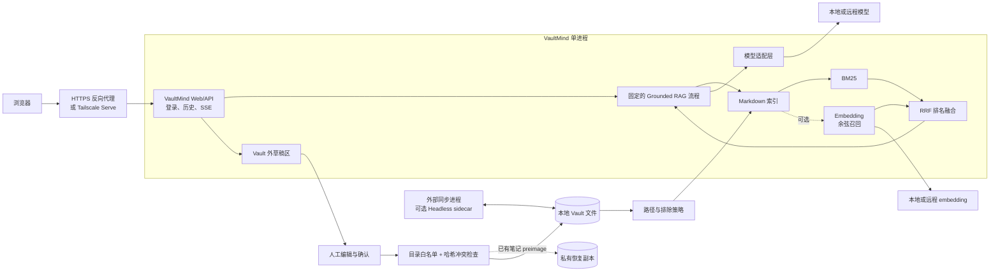

# VaultMind 中文说明

[English README](../README.md) · [部署指南](deployment.md) ·
[安全模型](security.md) · [同步说明](sync.md) ·
[网络接入](networking.md) · [简历与面试材料](resume.md)

VaultMind 是一个面向本地 Obsidian Vault 的自托管 RAG 知识工作台。
它提供知识问答、日记、计划、随心记、关键词与语义检索、SSE 流式输出、
来源预览和“预览后确认写入”的笔记工作流。模型与 embedding 由部署者
自行选择，API Key 只保存在服务端。

> [!IMPORTANT]
> 当前版本定位为单管理员、单节点的私人知识服务，不是多租户 SaaS。
> 应用始终消费服务器上的普通本地文件；同步由独立进程完成。

## 当前真正实现的能力

| 范围 | 当前实现 |
|---|---|
| 知识问答 | 基于检索片段生成答案，要求输出 Obsidian 路径引用，通过 SSE 持续返回 |
| 检索 | 中文友好 BM25；可选 dense embedding；余弦相似度与 RRF 融合；embedding 故障时回退关键词检索 |
| 笔记工作流 | 日记、计划、随心记生成；Markdown 可编辑预览；用户确认后才写入 |
| 文件体验 | 快速关键词检索、语义检索、来源预览、剪贴板附件和附件落盘 |
| 模型 | OpenAI-compatible、Anthropic；本地 Ollama/vLLM/LM Studio 可走兼容接口 |
| Embedding | 关闭、OpenAI-compatible、DashScope 原生 embedding 接口 |
| 运维 | Docker Compose、文件型 Secret、健康检查、索引监听/对账、审计日志、Caddy/Nginx/systemd 示例 |
| 同步 | 本地文件系统；可选的 Obsidian Headless 本地构建 sidecar；其他外部文件同步进程 |

Self-hosted LiveSync 目前**没有实现**，只属于路线图。

## 五分钟 Docker 快速开始

前提：已经安装 Docker Compose，并且已有一个可调用的模型端点。下面以
宿主机 Ollama 为例。仓库自带的 `vault/` 只适合演示；真实使用时请改为
一个已经备份的真实 Vault 绝对路径。

```bash
git clone https://github.com/kygoyuan2004/Second-Mind.git
cd Second-Mind
cp .env.example .env
ollama pull qwen3:8b
```

在 `.env` 中确认或修改：

```dotenv
VAULT_HOST_PATH=./vault

LLM_PROVIDER=openai-compatible
LLM_API_BASE=http://host.docker.internal:11434/v1
LLM_MODEL=qwen3:8b

EMBEDDING_PROVIDER=disabled
```

快速开始请保留 Compose 默认 UID/GID `1000`，因为 named data volume
按该身份初始化。若要映射其他宿主机用户，需要同时预配置 data volume
和 Vault 权限，详见 [deployment.md](deployment.md)。随后创建本地 Secret；
无鉴权的本地 Ollama 可以使用空的模型和 embedding key 文件。

```bash
mkdir -p secrets
chmod 700 secrets
umask 077
read -rsp "设置 VaultMind 管理员密码（至少 12 个字符）：" VAULTMIND_ADMIN_PASSWORD
printf '\n'
printf '%s' "$VAULTMIND_ADMIN_PASSWORD" > secrets/admin_password
unset VAULTMIND_ADMIN_PASSWORD
openssl rand -hex 32 > secrets/session_secret
: > secrets/llm_api_key
: > secrets/embedding_api_key
chmod 600 secrets/*
```

启动并检查：

```bash
docker compose \
  -f compose.yaml \
  -f compose.secrets.yaml \
  up -d --build

docker compose ps
curl --fail http://127.0.0.1:8787/health/live
curl --fail http://127.0.0.1:8787/health/ready
```

浏览器打开 <http://127.0.0.1:8787>，账号为 `admin`，密码是上一步输入
的值。大 Vault 首次构建索引时，`ready` 可能暂时返回 `starting`。

远程模型需要把 `.env` 中的地址改为 HTTPS，并将 key 写入
`secrets/llm_api_key`。生产部署建议继续阅读 [deployment.md](deployment.md)。

## 架构



读取链路与写入链路被刻意拆开：

- **读取：**安全文件网关 → Markdown 分块 → BM25/可选向量召回 → RRF →
  有界上下文 → 模型 → 带来源答案。
- **写入：**用户输入 → 模型生成 Markdown → Vault 外私有草稿 → 人工预览
  与编辑 → 明确确认 → 路径/并发检查 → 已有日记/计划的已验证 preimage
  恢复副本 → 二次哈希检查 → 白名单目录原子替换。

模型没有 Shell、任意文件工具或通用联网搜索工具。这不是自主 Agent，
而是一个可解释、边界固定的 RAG 与草稿流水线。

## 混合检索如何工作

当前索引支持 `.md`、`.txt`、`.json`、`.canvas`、`.base`、`.csv`、
YAML 和日志文件，单文件索引上限为 2 MiB。

1. 按标题、段落、列表、表格和代码围栏组织约 1500 字符的重叠分块；
2. 对中文、日期和编程标识符分词并计算 BM25；
3. 启用 embedding 后，仅对内容哈希变化的 chunk 重新向量化；
4. 使用余弦相似度召回 dense 候选，并通过 Reciprocal Rank Fusion 融合
   BM25 与向量名次；
5. 按文件去重，把路径和有限长度片段交给模型；
6. embedding 未启用或调用失败时，返回带诊断信息的关键词结果。

索引使用原子 generation 文件，并保留 current/previous 两代。启动时若
当前 generation 损坏，可回退上一代。文件监听负责快速更新，定时全量
对账负责补偿遗漏事件。

## BYOK、OpenAI-compatible、Anthropic 与 Ollama

所有凭据都由服务端通过环境变量或 `*_FILE` 读取，浏览器不会接触 key。

| 场景 | 配置方式 |
|---|---|
| OpenAI 或其他兼容服务 | `LLM_PROVIDER=openai-compatible`，配置 HTTPS API 根地址、模型 ID 和服务端 key |
| Anthropic | `LLM_PROVIDER=anthropic`，`LLM_API_BASE=https://api.anthropic.com`，配置模型 ID 与 key |
| Docker 容器访问宿主机 Ollama | `LLM_API_BASE=http://host.docker.internal:11434/v1`，key 可为空 |
| vLLM / LM Studio | 使用 OpenAI-compatible 模式，通过回环、私有容器网络或 HTTPS 访问 |

“OpenAI-compatible”只表示实现使用 `/chat/completions` 的请求与流式响应
结构，不代表任意标称兼容的网关都已被本项目逐个验证。

仅使用 BM25：

```dotenv
EMBEDDING_PROVIDER=disabled
```

启用混合检索示例：

```dotenv
EMBEDDING_PROVIDER=openai-compatible
EMBEDDING_API_BASE=https://your-provider.example/v1
EMBEDDING_MODEL=your-embedding-model
EMBEDDING_DIMENSIONS=768
```

另一个已实现的 embedding 适配器是 `dashscope`。维度必须与服务返回值
完全一致；更换 provider、模型或维度后需要重建：

```bash
npm run index
```

使用远程 embedding 时，文档 chunk 和查询会离开服务器；使用远程 LLM
时，问题、近期对话、选中的笔记片段和文本附件片段会离开服务器。敏感
数据应选择本地模型，或审查供应商的存储、训练、地域与合规策略。

## 草稿确认写入

知识问答不写 Vault。日记、计划和随心记遵循以下协议：

- 草稿与临时附件位于私有数据目录，不在 Vault 内；
- 用户看到并可修改 Markdown 预览，点击确认前不落盘；
- 日记/计划保存前比较生成前后的目标文件哈希，检测并拒绝并发修改；
- 更新已有日记/计划前，将原内容复制到 `RECOVERY_DIR` 并校验 preimage
  哈希，随后再次核对目标哈希再原子替换；恢复副本通过
  `RECOVERY_RETENTION_DAYS` 配置，默认保留 30 天；
- 随心记标题会清理并选择不冲突的文件名；
- 应用只允许写 `DIARY_DIR`、`PLAN_DIR`、`SCRATCH_DIR`；
- 拒绝目录穿越、隐藏/排除路径、符号链接和非普通文件；
- 草稿创建、删除与确认写入会尝试追加 JSONL 审计事件；若提交后的审计
  写入失败，API 会返回明确警告，而不会把已经成功的 Vault 写入误报为失败。

恢复副本含旧版本私人内容，应按敏感数据保护 `DATA_DIR`。该流程能降低
覆盖风险并缩小竞态窗口，但不构成与同步服务之间的分布式 CAS/事务。
仍需使用保留冲突的同步策略和独立备份。

## 同步方案的真实边界

VaultMind 本身不上传、下载或合并 Vault。它只读取一个本地目录；
`SYNC_PROVIDER` 与 `SYNC_DISPLAY_NAME` 只是部署状态描述。

- `filesystem`：不管理同步，直接读取本地 Vault；
- `obsidian-headless`：可选 Compose overlay 在本地构建官方 Headless
  包，并把同一个 Vault 目录共享给 sidecar；
- `external`：由部署者维护其他能生成普通本地文件的同步进程。

Obsidian Headless 是外部上游的 open beta，需要 Node.js 22 和有效的
Obsidian Sync 订阅。其 npm 元数据当前标记为 `UNLICENSED`。主镜像没有
打包它；仓库中的 Dockerfile 只用于操作者本地安装。未经上游许可不要
发布或分发该 sidecar 镜像。启用前阅读
[官方 Headless 文档](https://obsidian.md/help/sync/headless)、
[npm 元数据](https://www.npmjs.com/package/obsidian-headless) 与
[本项目同步指南](sync.md)。

当前没有 CouchDB 服务、LiveSync 凭据加载、Setup URI 处理或经过测试的
Vault materializer，因此不能把 Self-hosted LiveSync 写成已支持能力。

## 安全边界

已实现：

- 单管理员账号；HMAC 签名、`HttpOnly`、`SameSite=Strict` 会话 Cookie；
- 登录尝试内存限流；同源校验；写请求必须包含
  `X-VaultMind-Request: 1`；
- 浏览器安全响应头和 DOMPurify Markdown 消毒；
- 文件型 Secret 与权限检查；
- Vault 根目录约束、隐藏目录排除和符号链接拒绝；
- 非本地模型端点默认必须 HTTPS；
- 容器非 root、只读根文件系统、删除全部 capability、
  `no-new-privileges`、PID 限制和默认仅回环地址发布。

必须诚实说明的边界：

- 没有 RBAC、SSO、多租户隔离；
- Docker 的 Vault bind mount 在内核层仍为读写，应用路径策略和宿主机
  权限属于最终写边界；
- 图片/PDF 只在确认后作为附件落盘，不做杀毒、OCR 或模型理解；
- 口述使用浏览器可选语音识别；某些浏览器/平台可能把音频交给厂商服务
  处理，口述敏感内容前应自行确认浏览器的隐私行为；
- 登录限流和运行中任务保存在内存，重启后丢失；
- Docker daemon、宿主机 root、服务账号、备份和同步凭据均是高权限
  信任边界。

远程使用优先选择 Tailscale Serve；公网云服务器应使用 Caddy/Nginx
终止 HTTPS，只开放 443，不要把 8787 原始端口暴露到互联网。详见
[security.md](security.md) 与 [networking.md](networking.md)。

## 测试与评测

本地开发要求 Node.js 22 或更新版本：

```bash
npm ci
npm run verify
```

`verify` 会执行语法检查、Node 测试和 Secret/私人路径发布阻断扫描。
当前测试套件覆盖登录与写请求保护、模型与 embedding 适配器、流式响应、
中文 BM25/混合检索、embedding 降级、原子索引回退、端到端 API、草稿
冲突、附件和文件路径策略。

覆盖率命令：

```bash
npm run test:coverage
```

合成检索 smoke evaluation：

```bash
VAULT_PATH=examples/demo-vault \
INDEX_DIR=/tmp/vaultmind-demo-index \
EMBEDDING_PROVIDER=disabled \
npm run eval -- --k 3 --min-recall 1
```

当前 3 条合成查询得到 Recall@3 `1.0000`、MRR `0.8333`、nDCG@3
`0.8770`。这只证明评测链路可运行，不代表真实知识库质量，更不能当作
生产性能指标。正式比较检索方案前，应建立私有、人工标注的数据集。
详见 [../eval/README.md](../eval/README.md)。

Docker Compose 静态校验：

```bash
docker compose -f compose.yaml config --quiet
docker compose -f compose.yaml -f compose.secrets.yaml config --quiet
docker compose -f compose.yaml -f compose.obsidian-sync.yaml config --quiet
```

## 项目结构

```text
public/                         中文响应式前端
src/
  server.mjs                   HTTP API、安全头、健康检查
  task-manager.mjs             QA/笔记任务与 SSE 流程
  knowledge-index.mjs          分块、BM25、向量、RRF、索引持久化
  llm-client.mjs               OpenAI-compatible/Anthropic 适配器
  embedding-client.mjs         OpenAI-compatible/DashScope 适配器
  path-policy.mjs              路径边界、排除目录、符号链接策略
  vault-store.mjs              草稿区、恢复副本、确认写入
  auth.mjs                     单管理员会话与写请求保护
test/                          单元与端到端测试
eval/                          合成评测数据集与执行器
examples/demo-vault/           可公开的演示语料
scripts/                       校验、重建索引、评测、Secret 扫描
compose*.yaml                  基础、Secret、可选同步部署
docker/                        Obsidian Headless 本地构建配方
deploy/                        Caddy、Nginx、systemd 示例
docs/                          部署、网络、安全、同步和简历材料
```

## 当前限制

- 单管理员、单 Node.js 进程；没有 RBAC、SSO、分布式任务队列和横向扩展；
- 索引和会话为本地 JSON 状态，定位个人/小团队单节点，而非企业级语料库；
- BM25 在进程内计算，大型 Vault 需要倒排索引或独立检索存储；
- 只索引支持的文本格式；不做图片/PDF OCR 或多模态理解；
- 服务端语音转写未启用，口述依赖浏览器/平台且可能使用厂商语音服务；
- 没有通用联网搜索、Shell、任意 Agent 工具或自主修改 Vault；
- 恢复副本与重复哈希检查不是与 Sync 的分布式锁/CAS；
- Obsidian Headless 只是可选外部依赖，不随主镜像发布；
- Self-hosted LiveSync 尚未实现。

## 路线图

以下是设计方向，不是已经交付的功能或时间承诺：

- [ ] 独立、可测试的 Self-hosted LiveSync materializer，隔离 CouchDB
  凭据与加密口令，并覆盖删除、重命名、冲突、附件和恢复测试；
- [ ] 真正的可插拔同步/materializer 接口，而不只是状态标签；
- [ ] 可扩展的倒排/向量存储适配器和后台任务队列；
- [ ] 带明确隐私边界的 OCR/多模态摄取；
- [ ] 在完成租户隔离设计后增加多用户身份与 RBAC；
- [ ] 更大的人工标注评测集、回归看板与部署可观测性。

## 简历与面试

项目的诚实简历表述、STAR 模板、证据映射和常见追问整理在
[resume.md](resume.md)。请只保留自己真正实现、测试和部署过的内容。

## License

VaultMind 仓库代码使用 [MIT License](../LICENSE)。第三方组件保留其各自
许可；本地构建的 `obsidian-headless` 不属于 VaultMind MIT 授权范围。
