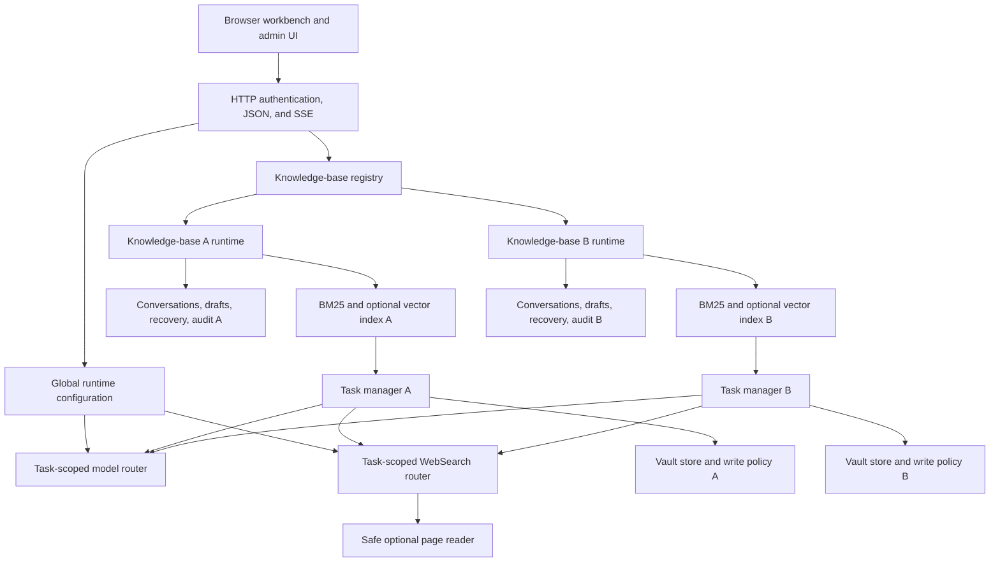

# Second Mind architecture

Second Mind is a single-process Node.js service with server-served static assets and JSON/SSE APIs. It runs one authenticated administrator experience over one or more filesystem knowledge bases. Docker Compose is the supported default deployment, but the application can also run directly under Node.js `^22.22.0` or `>=24.8.0` when the operator provides equivalent filesystem and secret isolation.

## Component map

## Startup and readiness

`src/bootstrap.mjs` performs the production bootstrap:

1. Load environment defaults and file-backed authentication secrets.
2. Open or create the private runtime configuration, including a last-known-good copy.
3. Open the knowledge-base registry and validate its allowed mount boundaries.
4. When the configured mount is a parent directory and no managed registry exists, discover only immediate child directories that contain `.obsidian`, up to the 32-base limit.
5. Create one runtime context for every enabled, available knowledge base.
6. Build or open a lexical index without calling a remote provider.
7. Report ready when at least one enabled base has a usable index.

`/health/live` reports process liveness. `/health/ready` reports `200` only when initialization completed and at least one knowledge base is ready. A failed base remains visible with a bounded error code and does not stop a different healthy base from serving requests.

## Knowledge-base registry

Each registry entry contains a stable `knowledgeBaseId`, display name, allowed mount ID, relative path, enabled flag, default flag, and derived entry revision. Exactly one enabled entry is the default, at least one entry remains enabled, and the registry contains between 1 and 32 entries.

The registry rejects:

- absolute paths or traversal outside an allowed mount;
- a symbolic-link traversal or unavailable path during an update;
- a managed directory without an actual, non-symlink `.obsidian` marker;
- duplicate or nested knowledge-base roots;
- overlapping allowed mounts;
- overlap between a Vault mount and private application state.

The public API never reveals host mount paths. The administrator API exposes only mount IDs, human-readable labels, and Vault-relative paths. Updates use compare-and-swap with `expectedRevision`, require password reauthentication, and fail if an affected base has an active task.

Removing a registry entry retires its in-memory runtime but does not delete the Vault or private state on disk.

A private, mode-restricted binding ledger stores only an ID and a digest of its first canonical Vault root. The ledger is committed before a registry update and retains removed IDs, so neither delete/re-add, restart, nor an external registry refresh can bind an old semantic ID to a different Vault. Operators replacing a mount with different content at the identical host path must assign a new ID; host mount manipulation is outside the remote API trust boundary.

## Per-base runtime context

Every enabled base receives its own:

- `KnowledgeIndex` and active/previous embedding slot state;
- `VaultStore` and path-policy instance;
- conversation file;
- private drafts and temporary attachments;
- recovery copies;
- audit log;
- `TaskManager` and active-task namespace.

New managed bases store these under an ID-and-canonical-root-bound directory in the private data volume. A migrated legacy default base retains its earlier state locations. Opaque task, conversation, and draft IDs are resolved only inside the selected context, so using an ID with another `knowledgeBaseId` returns not found instead of crossing boundaries.

Each knowledge response carries `knowledgeBaseId`, `knowledgeBaseRevision`, and `knowledgeBaseName`. The browser also uses a selection epoch to discard responses and events that complete after the user switches bases. Switching the UI does not cancel a task already running in the previous base.

## Global runtime services

The managed Provider registry is global to the application instance. It defines model connections, enabled model bindings, the default model, independent WebSearch providers, an embedding target, and branding. Provider credentials are private server state and are represented to clients only by boolean configured fields.

At most three models may be enabled. A model binding selects a registered provider adapter and protocol. Alibaba Model Studio, DeepSeek, GLM, Kimi, and Custom adapters constrain endpoints, authentication, output limits, and reasoning mappings. Custom services receive only protocol-common fields unless the administrator explicitly selects a supported adapter.

A task acquires immutable model and WebSearch leases when it is created. Saving a new configuration changes later tasks, not a running task. Provider validation occurs before a secret-bearing candidate can be committed. Configuration files use restrictive permissions, atomic replacement, revision checks, and last-known-good recovery.

Embedding configuration is globally selected, but vector activation is per knowledge base. An administrator explicitly validates and rebuilds the selected base into a new slot. Activation happens only after the new index succeeds. Startup never creates the first remote vector index and never silently replaces an active usable slot.

## Retrieval and generation

All bases have a lexical BM25 path. When an activated embedding slot is available, semantic and hybrid reciprocal-rank-fusion routes become available. A failed semantic dependency is reported explicitly; Normal and Deep question answering can use lexical evidence without a vector service.

Normal mode follows one bounded retrieval path. Deep mode produces a bounded query set, fuses evidence, tracks conflicts and gaps, and can run bounded feedback rounds. Optional WebSearch and selected-page reading are server-controlled. The model receives delimited text, not a shell, filesystem API, browser, MCP client, or arbitrary fetch capability.

Only Vault source IDs and paths that actually entered model context are allowed to become Vault citations. The server rejects invented source identifiers during answer normalization.

## Conversations and task state

Conversations persist complete user and assistant messages, model selection, requested and effective effort, task mode, WebSearch selection, and immutable Provider binding identities. Normal and Deep may change within the same Q&A conversation. Changing the model, effort, or WebSearch setting creates an explicit child conversation; at most five complete prior turns are copied.

Task status and progress are exposed through JSON and SSE. Active task state is in memory, while the conversation checkpoint is durable. A task failure or cancellation does not commit a partial assistant turn. Raw search payloads, fetched pages, and hidden model reasoning are not conversation messages.

## Confirmed write path

Diary, plan, and scratch-note generation creates a private draft outside the Vault. A save request is accepted only after the server revalidates the authenticated owner, selected knowledge base, permitted destination directory, filename, symbolic-link boundary, draft expiry, and expected target hash.

The service writes a temporary file in the destination directory and atomically renames it. Before replacing an existing diary or plan, it preserves and verifies a recovery preimage. There is no distributed transaction with an external sync process, so independent backups and conflict monitoring remain necessary.

## Deliberate scope

- One administrator identity, not RBAC or multi-tenant isolation.
- Local filesystem Vaults, not a database-backed document store.
- No model-controlled shell, general browser, or arbitrary file API.
- No automatic restore or destructive uninstall workflow.
- No implemented Self-hosted LiveSync materializer.
- Optional Obsidian Headless and any other sync engine remain separate trust boundaries.

See [data flow](data-flow.md), [security](security.md), and [deployment](deployment.md) for operational consequences.
