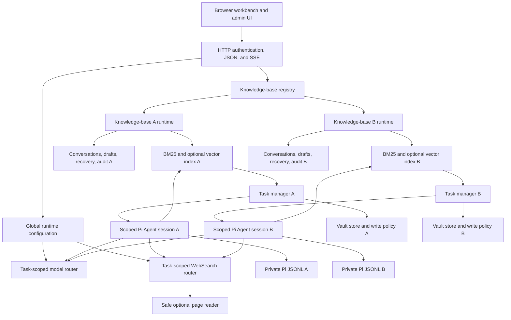

# Second Mind architecture

Second Mind is a single-process Node.js service with server-served static assets and JSON/SSE APIs. It runs one authenticated administrator experience over one or more filesystem knowledge bases. Q&A uses an embedded Pi Agent `0.85.1` tool loop rather than a fixed server-orchestrated reading pipeline. Docker Compose is the supported default deployment, but the application can also run directly under Node.js `^22.22.0` or `>=24.8.0` when the operator provides equivalent filesystem and secret isolation.

## Component map

## Startup and readiness

`src/bootstrap.mjs` performs the production bootstrap:

1. Load environment defaults and file-backed authentication secrets.
2. Open or create the private runtime configuration, including a last-known-good copy.
3. Open the knowledge-base registry and validate its allowed mount boundaries.
4. When the configured mount is a parent directory and no managed registry exists, discover only immediate child directories that contain `.obsidian`, up to the 32-base limit.
5. Create one runtime context for every enabled, available knowledge base.
6. Build or open a lexical index without calling a remote provider.
7. Report ready when at least one enabled base has a usable index.

`/health/live` reports process liveness. `/health/ready` reports `200` only when initialization completed and at least one knowledge base is ready. A failed base remains visible with a bounded error code and does not stop a different healthy base from serving requests.

## Knowledge-base registry

Each registry entry contains a stable `knowledgeBaseId`, display name, allowed mount ID, relative path, enabled flag, default flag, and derived entry revision. Exactly one enabled entry is the default, at least one entry remains enabled, and the registry contains between 1 and 32 entries.

The registry rejects:

- absolute paths or traversal outside an allowed mount;
- a symbolic-link traversal or unavailable path during an update;
- a managed directory without an actual, non-symlink `.obsidian` marker;
- duplicate or nested knowledge-base roots;
- overlapping allowed mounts;
- overlap between a Vault mount and private application state.

The public API never reveals host mount paths. The administrator API exposes only mount IDs, human-readable labels, and Vault-relative paths. Updates use compare-and-swap with `expectedRevision`, require password reauthentication, and fail if an affected base has an active task.

Removing a registry entry retires its in-memory runtime but does not delete the Vault or private state on disk.

A private, mode-restricted binding ledger stores only an ID and a digest of its first canonical Vault root. The ledger is committed before a registry update and retains removed IDs, so neither delete/re-add, restart, nor an external registry refresh can bind an old semantic ID to a different Vault. Operators replacing a mount with different content at the identical host path must assign a new ID; host mount manipulation is outside the remote API trust boundary.

## Per-base runtime context

Every enabled base receives its own:

- `KnowledgeIndex` and active/previous embedding slot state;
- `VaultStore` and path-policy instance;
- conversation file;
- private drafts and temporary attachments;
- recovery copies;
- audit log;
- Pi session associations and a private transactional JSONL namespace;
- `TaskManager` and active-task namespace.

New managed bases store these under an ID-and-canonical-root-bound directory in the private data volume. A migrated legacy default base retains its earlier state locations. Opaque task, conversation, and draft IDs are resolved only inside the selected context, so using an ID with another `knowledgeBaseId` returns not found instead of crossing boundaries.

Each knowledge response carries `knowledgeBaseId`, `knowledgeBaseRevision`, and `knowledgeBaseName`. The browser also uses a selection epoch to discard responses and events that complete after the user switches bases. Switching the UI does not cancel a task already running in the previous base.

## Global runtime services

The managed Provider registry is global to the application instance. It defines model connections, enabled model bindings, the default model, independent WebSearch providers, an embedding target, and branding. Provider credentials are private server state and are represented to clients only by boolean configured fields.

At most three models may be enabled. A model binding selects a registered provider adapter and protocol. Alibaba Model Studio, DeepSeek, GLM, Kimi, and Custom adapters constrain endpoints, authentication, output limits, and reasoning mappings. Anthropic Messages maps to Pi's `anthropic-messages` API and OpenAI Chat Completions maps to `openai-completions`. Custom services receive only protocol-common fields unless the administrator explicitly selects a supported adapter.

A task acquires immutable model and WebSearch leases when it is created. Saving a new configuration changes later tasks, not a running task. Before a secret-bearing model candidate can be committed, production validation requires an unpredictable nonce tool call followed by a later assistant turn that consumes the exact tool result. The first Q&A also runs this full probe when the exact binding has not been verified in the current service process; failure stops the task rather than selecting an old text-only engine. Configuration files use restrictive permissions, atomic replacement, revision checks, and last-known-good recovery.

Embedding configuration is globally selected, but vector activation is per knowledge base. An administrator explicitly validates and rebuilds the selected base into a new slot. Activation happens only after the new index succeeds. Startup never creates the first remote vector index and never silently replaces an active usable slot.

## Retrieval and generation

All bases have a lexical BM25 route. When an activated embedding slot is available, semantic and hybrid reciprocal-rank-fusion routes become available. A failed semantic dependency is reported explicitly; the Agent can still choose lexical discovery without a vector service.

Normal and Deep use the same embedded Pi Agent execution engine with different bounded research budgets. After every result, the model chooses its next call from `list_vault`, exact-text `search_text`, keyword/semantic/hybrid `search_knowledge`, hash-checked and paginated `read_note`, `resolve_note_reference`, paginated `list_date_records`, and `get_reading_coverage`. Search results only discover candidates; material claims require non-empty original text successfully returned by `read_note`, and the coverage ledger distinguishes complete reads, partial line ranges, unread discoveries, incomplete inventory/list pagination, truncation, and tool failures. Exhaustive requests have a server-enforced coverage-check completion gate.

When a user explicitly enables networking, the toolset may add `web_search` and `web_read`. Both Web tools close permanently after the first Vault tool result, so private note content cannot influence a later query, URL choice, request count, or order. Before that boundary, `web_read` accepts only exact HTTPS URLs returned by the same task's search and retains the safe-reader network controls. Learning reviews receive neither tool. The Pi session is created with all built-in tools disabled and an empty resource loader: no shell, mutation tool, general filesystem API, arbitrary fetch, host extension, skill, prompt, `AGENTS.md`, `~/.pi`, or `~/.claude` configuration is loaded.

Only hash-verified Vault paths actually returned by `read_note` are eligible as Vault sources. The server rejects invented or merely search-discovered citations during answer normalization.

## Conversations and task state

Conversations persist complete user and assistant messages, model selection, requested and effective effort, task mode, WebSearch selection, immutable Provider binding identities, and a validated Pi session filename. Normal and Deep may change within the same Q&A conversation. Changing the model, effort, or WebSearch setting creates an explicit child conversation; at most five complete prior turns are copied.

Pi writes each in-flight turn eagerly, so every task runs in a disposable JSONL branch under `DATA_DIR/pi-sessions`; POSIX deployments constrain the directory to `0700` and files to `0600`. After citation normalization, the application builds a canonical checkpoint containing only committed product user/assistant turns plus a history digest. Product conversation history remains authoritative and atomically stores only that safe basename, never a caller-supplied path. Failed/cancelled branches are removed, superseded and deleted-conversation checkpoints are reclaimed, and startup prunes unreferenced safe JSONL files. An unsafe, missing, unreadable, or history-mismatched checkpoint is rebuilt from committed product history.

A Web-enabled Pi turn is deliberately different: it starts a fresh working session containing only the current request. It does not resume a checkpoint or bootstrap earlier product messages, because a prior assistant turn may contain private Vault text that must never become a later `web_search` query before the per-task Web-to-Vault latch closes. The full product conversation remains visible and durable, but context-dependent Web questions must restate the necessary public context in the current request.

Task status, Pi lifecycle/tool progress, coverage, usage, and completion are exposed through JSON and SSE. Pi answer deltas are measured but buffered until citation and link finalization; the client receives only terminal validated answer Markdown, while lifecycle/tool/usage/heartbeat events continue during generation. External anchors are created from successfully read source IDs by server code, and the assistant renderer unwraps any other anchor. Active task state is in memory, while the product conversation checkpoint and completed Pi entries are durable. A task failure or cancellation does not commit a partial assistant turn, and an in-flight task does not automatically continue across a service-process restart. Raw search payloads, fetched pages, and hidden model reasoning are not product conversation messages.

## Confirmed write path

Diary, plan, and scratch-note generation creates a private draft outside the Vault. A save request is accepted only after the server revalidates the authenticated owner, selected knowledge base, permitted destination directory, filename, symbolic-link boundary, draft expiry, and expected target hash.

The service writes a temporary file in the destination directory and atomically renames it. Before replacing an existing diary or plan, it preserves and verifies a recovery preimage. There is no distributed transaction with an external sync process, so independent backups and conflict monitoring remain necessary.

## Deliberate scope

- One administrator identity, not RBAC or multi-tenant isolation.
- Local filesystem Vaults, not a database-backed document store.
- No model-controlled shell, general browser, or arbitrary file API.
- No automatic restore or destructive uninstall workflow.
- No implemented Self-hosted LiveSync materializer.
- Optional Obsidian Headless and any other sync engine remain separate trust boundaries.

See [data flow](data-flow.md), [security](security.md), and [deployment](deployment.md) for operational consequences.
