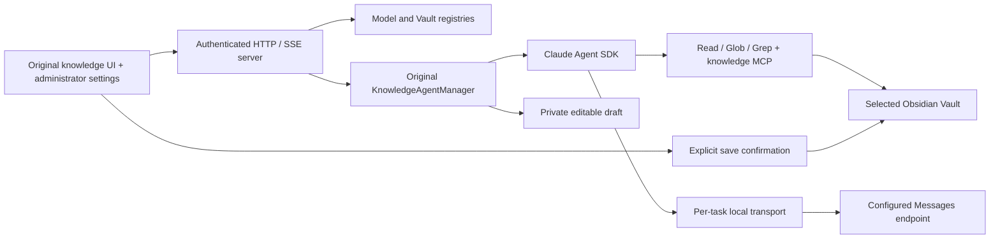

# Architecture

Second Mind uses the current original knowledge application as its baseline. The production executor is `@anthropic-ai/claude-agent-sdk@0.3.247`; it owns the iterative agent loop, tool decisions, session continuation, and streaming output.

## Source map

| Component | Implementation |
| --- | --- |
| Original prompts, budgets, tasks and events | `src/original/knowledge-agent.mjs` |
| Original retrieval, tokenizer, chunks, caches and RRF | `src/original/knowledge-index.mjs`, `knowledge-store.mjs`, `bailian-retrieval.mjs` |
| Original task modes, learning review and subagent policy | `src/original/task-modes.mjs`, `learning-review.mjs`, `subagent-policy.mjs` |
| Native SDK credentials and HTTPS forwarding | `src/sdk-runtime.mjs`, `model-transport.mjs` |
| Managed models, permission hooks and lifecycle | `src/sdk-knowledge-manager.mjs` |
| Additive old-state import and confirmed writes | `src/sdk-state-migration.mjs`, `sdk-knowledge-store.mjs` |
| Per-Vault index activation and runtime | `src/sdk-knowledge-index.mjs`, `knowledge-base-runtime.mjs`, `embedding-runtime.mjs` |
| Web tools and private Tavily worker | `src/sdk-web-search.mjs`, `tavily-launcher.mjs` |
| Speech/video | `src/original/knowledge-transcriber.mjs`, `knowledge-video.mjs`, `src/scripts/*.py` |
| Original browser interface | `public/knowledge.html`, `knowledge.js`, `knowledge.css`, source and clipboard helpers |
| Retained administration | `public/admin-config.*`, `runtime-config-registry.mjs`, `provider-config-service.mjs`, `knowledge-base-registry.mjs` |

## Startup and persistence

The HTTP listener exposes liveness before index initialization finishes. Other routes return `503` during initialization; readiness reflects available knowledge bases. Startup does not call paid models or build a first remote embedding index.

Each registered Vault owns private `sdk-v1` state: conversations, SDK sessions, drafts, index/profile slots, audit records, recovery files, and migration receipts. The original state remains beside it. Model configuration is shared; selected-Vault embedding activation is separate. Configuration saves affect subsequent tasks, while an active task retains its connection snapshot. Model/endpoint changes require a new SDK conversation; key rotation does not move a conversation to another provider.

## Execution

Normal tasks keep the original 20-turn/10-minute limit. Deep Q&A keeps 50 turns/30 minutes and at most two conditional read-only subagents. Learning reviews use 50 turns/30 minutes, at most 40 read/search calls and a 24-minute reading phase. The SDK performs context handling and resume; the old fixed research pipeline is not used.

The SDK has no Bash, edit, or write tools. Application hooks constrain reads to the selected root and reject symbolic-link traversal. This is an application permission boundary, not a separate operating-system sandbox. Model keys remain in the server, behind an authenticated loopback Messages transport.

See [migration differences](claude-sdk-migration.md), [data flow](data-flow.md), and [API](api.md). Historical implementation material under `archive/pi/` is not part of current runtime or test claims.
